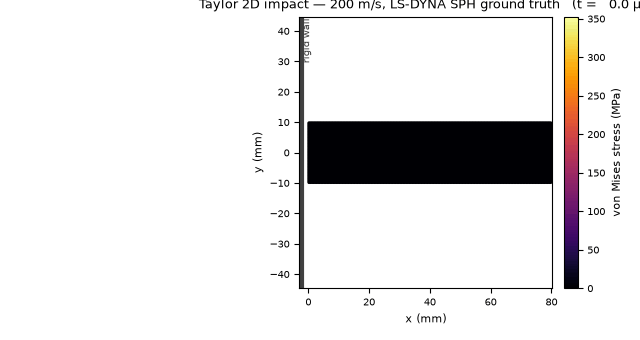
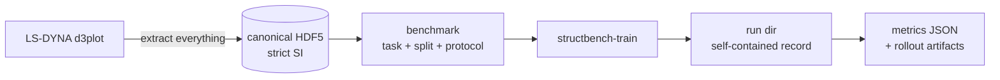

# StructBench

**Standardized benchmarks for machine learning on structural simulation.**
A task definition, a fixed split, metrics in physical units, and a reference
baseline to beat — for structures under dynamic and extreme loading.

[](LICENSE)
[](pyproject.toml)

> **Status: pre-release (v0.1 imminent).** What exists is real and tested;
> what doesn't is on the [roadmap](#roadmap).



*A 2D copper bar striking a rigid wall at 200 m/s — LS-DYNA SPH ground truth,
colored by von Mises stress. The prediction-vs-truth comparison replaces this
once the baseline training run completes.*

## Benchmarks

| Benchmark | Problem | Cases |
|---|---|---|
| Taylor2D-Impact | copper bar impact (SPH, plasticity) | 33 |
| Wave1D-Propagation | elastic wave in a bar (entry tier) | 16 |
| NotchBeam2D-Bend | notched concrete beam, 3-point bend | 111 |
| NotchBeam2D-Impact | notched concrete beam, drop-weight impact | 110 |

Full cards (solver, materials, splits, QoIs): [docs/benchmarks.md](docs/benchmarks.md).
Every benchmark fixes its task, split, and evaluation protocol in an ADR —
changing any of them is a new benchmark version — and all metrics are
reported in physical units (mm, MPa), never dimensionless scores.

## Why

If you have trained ML surrogates on structural simulation data, you know the
routine:

- **Every paper ships its own post-processing** — one-off scripts that pull
  just the fields that paper needed out of solver binaries, in whatever units
  the deck happened to use. The next project starts from zero.
- **Evaluations don't reproduce** — undocumented splits, normalized-unit
  metrics, and a different meaning of "rollout error" in every codebase.
- **The install is the first experiment that fails** — most GNS-style
  codebases need compiled graph extensions matched to your exact
  torch + CUDA + OS combination.

Underneath sits a question the field keeps circling: *can a learned simulator
reproduce the full elasto-plastic response of a structure under impact, fast
enough to be useful?* Explicit solvers cost minutes to days per run; design
sweeps, probabilistic assessment, and inverse problems want thousands of runs.
StructBench exists so answers to that question can be compared: standardized
benchmarks, honest evaluation, reference baselines you can rerun.

## Quickstart

```bash
git clone https://github.com/qilinli/StructBench
cd StructBench
pip install -e .
```

Installs from wheels on Linux, macOS, and Windows, CPU or CUDA. **No compiled
graph dependencies**: a native pure-torch `radius_graph` replaces
`torch-cluster`/`pyg-lib` (`torch_geometric` is used for `MessagePassing`
only) — no C++ build step, no CUDA-version matching dance. If you have fought
GNS codebases on a cluster or on Windows, you know why this matters.

```bash
# Train the GNS baseline
structbench-train --mode train --config configs/taylor_impact_2d/gns.toml \
    --data-root /path/to/StructBench/canonical/taylor_impact_2d --out runs/taylor-gns

# Validate, then roll out on the test splits (architecture is rebuilt from
# the run directory's own record — no --config needed, or accepted)
structbench-train --mode valid   --data-root /path/to/StructBench/canonical/taylor_impact_2d --out runs/taylor-gns
structbench-train --mode rollout --data-root /path/to/StructBench/canonical/taylor_impact_2d --out runs/taylor-gns
```

Configs are grouped per benchmark (ADR-0032): swap
`configs/taylor_impact_2d/gns.toml` for `configs/wave_propagation_1d/gns.toml`,
`configs/notch_beam_2d_bend/gns.toml`, or `configs/notch_beam_2d_impact/gns.toml`
to train against a different benchmark.

**Data availability:** each benchmark ships as a self-contained canonical
archive — a `canonical/<benchmark>/` folder of `<case_id>.h5` files with a
generated `README.md`, `card.json`, and CC BY 4.0 license — and `--data-root`
points at that folder. Hosting is being finalised for the v0.1 release; until
then, the adapter can ingest your own LS-DYNA output.

## How the pieces fit



The LS-DYNA adapter (built on `lasso-python`) follows an **extract-everything
policy**: positions, velocities, full stress and strain tensors, plastic
strain, energies, erosion state — all of it lands in the HDF5 whether or not
the current task uses it. You never re-run post-processing because a reviewer
asked for stress instead of displacement. The format is solver-agnostic by
design — the canonical schema is the contract, not LS-DYNA — and it has
already ingested a second dataset family (a concrete-beam SPH case) unchanged.
Sibling adapters (Kratos, OpenSees, OpenRadioss, …) are the intended path for
other solvers.

**Reproducibility contract.** Every run directory is self-contained —
`config.json` (fully resolved), `normalization_stats.npz`, `model-*.pt`
checkpoints — and evaluation rebuilds the exact architecture from the run's
own record, never from whatever the current code default happens to be.
Metrics land as `metrics-<split>.json` plus per-case predicted-trajectory
`.npz` files: a run directory is the complete, portable evidence for its
numbers. The repo carries a deterministic CPU-only test suite, is mypy- and
ruff-clean, and pins its environment with a `uv` lockfile.

## Repository layout

```
src/structbench/
  core/            # case schema, validation, HDF5 I/O, LS-DYNA adapter
  datasets/        # canonical readers, windowing, normalization
  benchmarks/      # one module per benchmark: split + protocol + QoIs
  models/gns/      # reference GNS (native radius_graph, no compiled deps)
  eval/            # rollout driver, metrics
  cli/             # structbench-train
configs/           # grouped TOML run configs, configs/<benchmark>/<family>.toml (ADR-0032)
decisions/         # architecture decision records
```

## Roadmap

<!-- Living todo list (the single planning home; ROADMAP.md is retired).
     Conventions: done = [x] + strikethrough + (date); ad-hoc additions land
     in Inbox and get triaged into a milestone; when a milestone ships, its
     crossed-out block may be compressed to one line. Reasoning lives in
     decisions/, not here. Substrate-layer work only (ADR-0014). -->

*Last revised: 2026-07-05.*

### v0.1 — Taylor 2D substrate proof

- [x] ~~Canonical case format + round-trip-tested HDF5 I/O (ADR-0011..0013)~~
- [x] ~~General LS-DYNA adapter on lasso-python (ADR-0016)~~
- [x] ~~Taylor 2D benchmark: fixed split, eval protocol, QoIs (ADR-0019)~~
- [x] ~~Config-driven pipeline `structbench-train` (train/valid/rollout)~~
- [x] ~~`radius_graph` batch-partition fix: 50.9 s → 0.22 s per batch~~ (2026-07-02)
- [x] ~~Public GitHub repository~~ (2026-07-02)
- [x] ~~First full baseline run → training-recipe rework (ADR-0028)~~ (2026-07-03)
- [ ] Trained GNS baseline with the ADR-0028 recipe (DUG A100; SSH-side
      steps are human-gated)
  - [ ] full retrain (~⅓ of the first run's 14k steps/h — plan walltime
        accordingly)
  - [ ] checkpoint + recorded ADR-0019 metrics
- [ ] Release: baseline metrics recorded (per-benchmark README),
      prediction-vs-truth hero GIF, dataset link, version tag (human action)

### v0.2 — wave-1d + notch-beam pair

- [x] ~~Ingestion: 16 wave runs + 221 notch-beam cases to canonical HDF5~~ (2026-07-04)
- [x] ~~Three benchmark modules: frozen splits + QoIs (ADR-0025/0026)~~ (2026-07-03)
- [x] ~~Benchmark cards + generated views (ADR-0027), Taylor retrofitted~~ (2026-07-03)
- [x] ~~Benchmark-selection registry in `structbench-train`~~ (2026-07-03)
- [x] ~~Notch aux → max principal strain; damaged→cracked fraction (ADR-0029)~~ (2026-07-04)
- [x] ~~Data archive reorganized to the hosting layout:
      `StructBench/{canonical,raw}` mirrors (ADR-0031)~~ (2026-07-05)
- [x] ~~ADR-0030 unit-fix follow-through: patch confirmed on all 237 files,
      converters + cards corrected, ADR written + indexed~~ (2026-07-05)
- [ ] Three trained GNS baselines (checkpoint + metrics each)
  - [ ] `wave_propagation_1d`
  - [ ] `notch_beam_2d_bend`
  - [ ] `notch_beam_2d_impact`
- [ ] Validate the provisional `cracked_fraction` threshold 0.01 (ADR-0029;
      version bump if revised)
- [ ] Dataset hosting: direction agreed 2026-07-05 — Zenodo, one record per
      benchmark, versions ↔ record DOIs; OneDrive stays the private master.
      Publish deferred until benchmark versions are final (gates the v0.1
      release; ADR to be drafted at publish time)
- [x] ~~Archive packaging: measure `size_gb` per benchmark (2.4 / 0.23 /
      24.1 / 24.9), generate per-archive README + card.json~~ (2026-07-05)

### Inbox — untriaged, add freely

- [ ] mypy fails on numpy 2.5 stubs (`type` statement needs py3.12 target;
      project floor is 3.11) — surfaced by the 2026-07-05 lockfile env
- [ ] DUG remote data dir is `data/taylor_impact`; rename to
      `taylor_impact_2d` (archive name) and update `train_taylor.slurm` +
      `hpc/dug/README.md` together, between job fleets
- [ ] per-benchmark README: dataset info, evaluation criteria, and (once
      trained) baseline results — likely grows out of the ADR-0027
      card-generated archive README (`tools/gen_benchmark_docs.py --archive`)
- [ ] `lr_init` code default still 1e-3; ADR-0028's 1e-4 lives only in the
      TOML
- [x] ~~confirm the Taylor deck genuinely is g-mm-ms~~ (verified against
      `scratch/Taylor.k`: RO/G/EOS-C physical only under g-mm-ms; recorded
      in ADR-0030, 2026-07-05)
- [ ] reconcile ADR-0012's "4 Voigt components in 2D" prose
      (CORRECTIONS.md item)

### Later (each becomes an ADR/spec when picked up)

- **v0.3 — RC beam benchmark**: erosion, twice (numerically for the FEM
  data; structurally for the surrogate — particles vanishing mid-rollout)
- Segmented beam benchmark (parked) · MS-GNS second Taylor baseline (spec
  Proposed)
- Training: resume support (optimizer state + `--resume`) ·
  part-id→embedding remap · ADR-0028 Phase-2 ablations (noise_std, aux
  head, capacity, stress-history)
- Eval: leaderboard submission validator · cross-benchmark utilities ·
  per-region probe metrics · convergence check
- Checkpoint-publishing workflow · second aux target (effective plastic
  strain)
- Data-generation autonomy (deck templating or a Python-native solver)
- Scale: cell-list `radius_graph` backend when a ≥10⁶-node dataset lands
- Other solvers (Kratos, OpenSees, OpenRadioss) · SHM expansion ·
  deployment tools · packaging extras · PhysicsNeMo interop

Rationale for every item lives in [`decisions/`](decisions/).

## How this project is run

StructBench is co-developed by its maintainer and an AI agent under an
explicit written harness: a decision log of ADRs, tiered agent authority,
and a corrections log — [HARNESS.md](docs/HARNESS.md) explains the philosophy.
Agent-assisted research needs the same auditability we demand of the
benchmarks themselves; whatever you think of the arrangement, the side effect
is useful to you as a reader: the *why* behind every choice in this repo is
written down.

## Limitations, stated plainly

Small datasets by learned-simulator standards — tens to low hundreds of cases
per benchmark, testing protocol rigor and rollout stability, not web-scale
generalization. 1D/2D problems only, no erosion yet (that is v0.3's open
problem), no experimental validation data. If you need any of those today,
this repo is not it yet; if you want a clean, reproducible number to beat on
a real solid-mechanics rollout task, it is.

## License

[Apache 2.0](LICENSE). A citation entry will accompany the first release.
