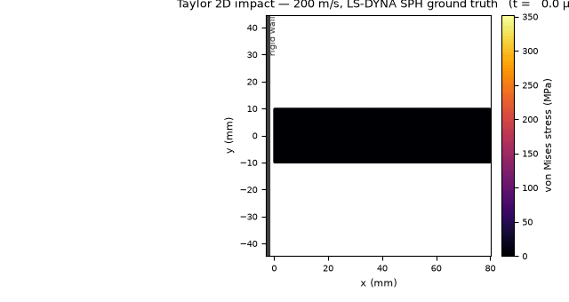

# StructBench

**Standardized benchmarks for machine learning on structural simulation.**
A task definition, a fixed split, metrics in physical units, and a reference
baseline to beat — for structural response prediction across loading regimes,
from quasi-static contact to impact and fracture.

[](LICENSE)
[](pyproject.toml)

> **Status: four benchmarks, four model families; cross-method leaderboards
> on Taylor, notch-impact, and DeformingPlate (wave-1D stays CGN-only).**
> v0.3.0 release-ready on `main` (tag pending); v0.2.0 was the last tagged
> release. What exists is real and tested; what doesn't is on the
> [roadmap](#roadmap).



*A 2D copper bar striking a rigid wall at 150 m/s — LS-DYNA SPH ground truth
(left) vs the CGN baseline's prediction (right), colored by von Mises stress.
See the [Taylor2D-Impact benchmark page](docs/benchmarks/taylor_impact_2d.md)
for the full problem, data, and numbers to beat.*

## Benchmarks

| Benchmark | Problem | Cases |
|---|---|---|
| Wave1D-Propagation | elastic wave in a bar (entry tier) | 16 |
| Taylor2D-Impact | copper bar impact (SPH, plasticity) | 33 |
| NotchBeam2D-Impact | notched concrete beam, drop-weight impact | 110 |
| DeformingPlate | hyperelastic 3D plate + rigid actuator (MeshGraphNets, quasi-static) | 1200 |

Ordered by constitutive regime: linear elastic → elastoplastic → concrete
fracture → 3D hyperelastic contact.
Full cards (solver, materials, splits, QoIs): [docs/benchmarks.md](docs/benchmarks.md).
Every benchmark fixes its task, split, and evaluation protocol in an ADR —
changing any of them is a new benchmark version. The headline metric is a
pooled space+time **relative L2** — the convention the neural-operator
literature reports, so StructBench numbers read directly against published
tables — with physical-unit RMSE (mm, MPa) and engineering quantities of
interest retained alongside it (ADR-0055).

## Reference models

Four model families, implemented natively in `src/structbench/models/` (no
compiled graph extensions, no PhysicsNeMo runtime dependency), spanning the
two dominant simulator paradigms — all trained and scored under one pipeline
and one protocol:

| Family | Paradigm | Status |
|---|---|---|
| CGN — Concrete Graph Network (Li et al. 2023 lineage) | autoregressive graph network | **blessed** baseline: wave-1D, Taylor, notch-impact |
| MeshGraphNets (Pfaff et al., 2021) | autoregressive graph network | **blessed**: DeformingPlate — reproduces the published error band; provisional: Taylor, notch-impact |
| Transolver (Wu et al., 2024; + Transolver++ variant, off by default) | attention operator, time-conditioned (ADR-0054) | provisional: Taylor, notch-impact, DeformingPlate |
| GeoFLARE (NVIDIA, 2025) | attention operator, time-conditioned | provisional: DeformingPlate |

*Blessed* means the result passed its benchmark's acceptance bar and anchors
the leaderboard (results registries: ADR-0033/0046; the DeformingPlate
published-band gate: ADR-0043); *provisional* marks best-effort native ports
with no published number to reproduce (ADR-0046). Per-benchmark
method-comparison tables live on the generated benchmark pages
([docs/benchmarks/](docs/benchmarks/)).

## Why

If you have trained ML surrogates on structural simulation data, you know the
routine:

- **Every paper ships its own post-processing** — one-off scripts that pull
  just the fields that paper needed out of solver binaries, in whatever units
  the deck happened to use. The next project starts from zero.
- **Evaluations don't reproduce** — undocumented splits, normalized-unit
  metrics, and a different meaning of "rollout error" in every codebase.
- **The install is the first experiment that fails** — most GNS-style
  codebases need compiled graph extensions matched to your exact
  torch + CUDA + OS combination.

Underneath sits a question the field keeps circling: *can a learned simulator
reproduce the full elasto-plastic response of a structure under impact, fast
enough to be useful?* Explicit solvers cost minutes to days per run; design
sweeps, probabilistic assessment, and inverse problems want thousands of runs.
StructBench exists so answers to that question can be compared: standardized
benchmarks, honest evaluation, reference baselines you can rerun.

## Quickstart

```bash
git clone https://github.com/qilinli/StructBench
cd StructBench
pip install -e .
```

Installs from wheels on Linux, macOS, and Windows, CPU or CUDA. **No compiled
graph dependencies**: a native pure-torch `radius_graph` replaces
`torch-cluster`/`pyg-lib` (`torch_geometric` is used for `MessagePassing`
only) — no C++ build step, no CUDA-version matching dance. If you have fought
GNS codebases on a cluster or on Windows, you know why this matters.

```bash
# Train the CGN baseline (Concrete Graph Network, Li et al. 2023)
structbench-train --mode train --config configs/taylor_impact_2d/cgn.toml \
    --data-root /path/to/StructBench/canonical/taylor_impact_2d --out runs/taylor-cgn

# Validate, then roll out on the test splits (architecture is rebuilt from
# the run directory's own record — no --config needed, or accepted)
structbench-train --mode valid   --data-root /path/to/StructBench/canonical/taylor_impact_2d --out runs/taylor-cgn
structbench-train --mode rollout --data-root /path/to/StructBench/canonical/taylor_impact_2d --out runs/taylor-cgn
```

Configs are grouped per benchmark (ADR-0032): swap
`configs/taylor_impact_2d/cgn.toml` for `configs/wave_propagation_1d/cgn.toml`
or `configs/notch_beam_2d_impact/cgn.toml` to train against a different
benchmark — or swap the model family within a benchmark, e.g.
`configs/deforming_plate/{mgn,transolver,geoflare}.toml` for the 3D
DeformingPlate benchmark (ADR-0041; operator adaptations ADR-0044/0045).

**Data availability:** each benchmark ships as a self-contained canonical
archive — a `canonical/<benchmark>/` folder of `<case_id>.h5` files with a
generated `README.md`, `card.json`, and CC BY 4.0 license — and `--data-root`
points at that folder. The archives are maintainer-held on institutional
storage (ADR-0040): request them from the maintainer, or ingest your own
LS-DYNA output via the adapter.

## Repository layout

```
src/structbench/
  core/            # case schema, validation, HDF5 I/O, LS-DYNA adapter
  datasets/        # canonical readers, windowing, normalization
  benchmarks/      # one module per benchmark: split + protocol + QoIs
  models/          # model families: cgn, mgn, transolver, geoflare (+ shared common/)
  eval/            # rollout driver, metrics
  viz/             # physics-quantity figures, FEM-postprocessor style (ADR-0022)
  cli/             # structbench-train
configs/           # grouped TOML run configs, configs/<benchmark>/<family>.toml (ADR-0032)
decisions/         # architecture decision records (ADRs)
tools/             # doc generation, the pooled-RMSE blessing aggregator, dev scripts
data_generation/   # solver decks + offline conversion scripts (data provenance)
hpc/               # cluster launch scripts (DUG SLURM)
docs/              # benchmark cards, architecture, harness, corrections
tests/             # deterministic CPU-only test suite
assets/            # figures embedded in the docs + landing pages
```

## Roadmap

<!-- Living todo list (the single planning home; ROADMAP.md is retired).
     Conventions: done = [x] + strikethrough + (date); ad-hoc additions land
     in Inbox and get triaged into a milestone; when a milestone ships, its
     crossed-out block may be compressed to one line. Reasoning lives in
     decisions/, not here. Substrate-layer work only (ADR-0014). -->

*Last revised: 2026-08-27.*

### Shipped

- [x] ~~**v0.1** (2026-07-09, `v0.1.0`) — substrate proof: canonical schema +
      HDF5 I/O, LS-DYNA adapter, Taylor2D-Impact + blessed CGN baseline
      (ADRs 0019/0021/0033/0034).~~
- [x] ~~**v0.2** (2026-08-06, `v0.2.0`) — Wave1D-Propagation + the notch-beam
      pair (notch-bend since descoped, ADR-0056), with cards, grouped configs,
      and results registries (ADRs 0024–0039); CGN blessed on wave-1d and
      notch-impact; hosting = OneDrive-on-request (ADR-0040).~~
- [x] ~~**v0.3** (2026-08-27, `v0.3.0`) — `DeformingPlate` multi-method
      benchmark on public data (ADR-0041: cross-method comparison is the
      headline): blessed MGN reproducing the published result, Transolver +
      GeoFLARE (+ off-by-default Transolver++) provisional, ranked
      cross-method leaderboards, the prediction-scheme axis, relative-L2
      headline metric (ADRs 0041–0057).~~

### Inbox — untriaged, add freely

<!-- Completed inbox items are removed at each release; their record lives in
     git history and the ADRs they cite. -->

- [ ] Human, out of session: publish the v0.3.0 GitHub release from
      `scratch/2026-08-27-v0.3.0-release-notes.md` (the tag is pushed).
- [ ] Human, out of session: update VISION.md's current-stage sentence
      ("dynamic and extreme loading" — v0.3's quasi-static 3D benchmark has
      outgrown it; drafted copy in `scratch/2026-08-27-vision-copy-draft.md`;
      VISION edits are forbidden-tier during coding sessions).

### Later (each becomes an ADR/spec when picked up)

- **Crash benchmark (v0.4 candidate)** — gated on public crash data existing
  (CarCrashNet's release, or maintainer-generated open-licence LS-DYNA data)
  plus the scale infrastructure it needs (cell-list `radius_graph`, TB-scale
  hosting); its methods already ship in v0.3 (ADR-0041)
- **Parked benchmarks** — RC beam (erosion is the gate, ADR-0024/0041) ·
  notch-bend (ADR-0056; module in-tree, re-registerable) · segmented beam
- Training: resume support · part-id→embedding remap · ADR-0028 Phase-2
  ablations
- Eval: leaderboard submission validator · per-region probe metrics ·
  convergence check · cross-benchmark utilities
- Data & scale: checkpoint-publishing workflow · second aux target (plastic
  strain) · data-generation autonomy · cell-list `radius_graph` when any
  ≥10⁶-node dataset lands · other solvers (Kratos, OpenSees, OpenRadioss) ·
  SHM expansion · deployment tools · packaging extras · PhysicsNeMo interop

Rationale for every item lives in [`decisions/`](decisions/).

## How this project is run

StructBench is co-developed by its maintainer and an AI agent under an
explicit written harness: a decision log of ADRs, tiered agent authority,
and a corrections log — [HARNESS.md](docs/HARNESS.md) explains the philosophy.
Agent-assisted research needs the same auditability we demand of the
benchmarks themselves; whatever you think of the arrangement, the side effect
is useful to you as a reader: the *why* behind every choice in this repo is
written down.

## Limitations, stated plainly

Small datasets by learned-simulator standards — tens to low hundreds of cases
per LS-DYNA benchmark (the public DeformingPlate set brings 1200), testing
protocol rigor and rollout stability, not web-scale generalization. Mostly
1D/2D with a first 3D benchmark; no erosion yet (the gate for the parked
RC-beam benchmark); no experimental validation data. If you need any of those
today, this repo is not it yet; if you want a clean, reproducible number to
beat on a real solid-mechanics rollout task, it is.

## License

[Apache 2.0](LICENSE). Cite via [CITATION.cff](CITATION.cff).
