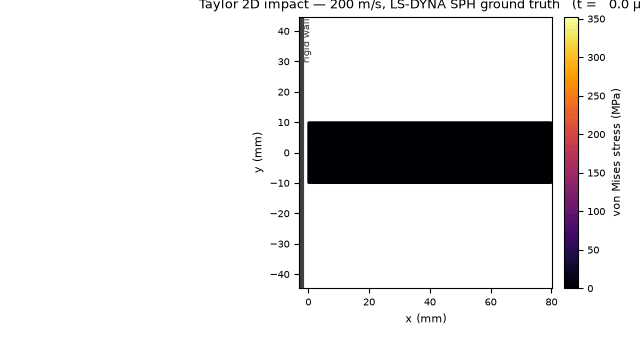

# StructBench

**Verification and validation benchmarks for learned surrogates of
structural response.** Can a data-driven simulator be trusted? Reference
data with declared uncertainty, a fixed task and split, evaluation protocols
that test physical consistency alongside accuracy in physical units, and
reference baselines you can rerun — for structural response across loading
regimes, from quasi-static contact to impact and fracture.

[](LICENSE)
[](pyproject.toml)
[](https://github.com/qilinli/StructBench/releases)

> **Status: four benchmarks, four model families; cross-method comparison
> tables on Taylor, notch-impact, and DeformingPlate (wave-1D stays
> CGN-only). Reporting verification properties — constraint satisfaction,
> state sufficiency, closure, error growth with horizon — alongside accuracy
> is the next protocol step (ADR-0065).** What exists is real and tested;
> what doesn't is on the [roadmap](#roadmap).



*A 2D copper bar striking a rigid wall at 150 m/s — LS-DYNA SPH ground truth
(left) vs the CGN baseline's prediction (right), colored by von Mises stress.
See the [Taylor2D-Impact benchmark page](docs/benchmarks/taylor_impact_2d.md)
for the full problem, data, and numbers to beat.*

## Benchmarks

| Benchmark | Problem | Cases | Data |
|---|---|---|---|
| Wave1D-Propagation | elastic wave in a bar (entry tier) | 16 | [Hugging Face](https://huggingface.co/datasets/StructBench/wave-propagation-1d) |
| Taylor2D-Impact | copper bar impact (SPH, plasticity) | 33 | [Hugging Face](https://huggingface.co/datasets/StructBench/taylor-impact-2d) |
| NotchBeam2D-Impact | notched concrete beam, drop-weight impact | 110 | [Hugging Face](https://huggingface.co/datasets/StructBench/notch-beam-2d-impact) |
| DeformingPlate | hyperelastic 3D plate + rigid actuator (MeshGraphNets, quasi-static) | 1200 | [public source](data_generation/meshgraphnets/deforming_plate/) |

Ordered by constitutive regime: linear elastic → elastoplastic → concrete
fracture → 3D hyperelastic contact.
Full cards (solver, materials, splits, QoIs): [docs/benchmarks.md](docs/benchmarks.md).
Every benchmark fixes its task, split, and evaluation protocol in an ADR —
changing any of them is a new benchmark version. The headline metric is a
pooled space+time **relative L2** — the convention the neural-operator
literature reports, so StructBench numbers read directly against published
tables — with physical-unit RMSE (mm, MPa) and engineering quantities of
interest retained alongside it (ADR-0055).

## Reference models

Four model families, implemented natively in `src/structbench/models/` (no
compiled graph extensions, no PhysicsNeMo runtime dependency), spanning the
two dominant simulator paradigms — all trained and scored under one pipeline
and one protocol:

| Family | Paradigm | Status |
|---|---|---|
| CGN — Concrete Graph Network (Li et al. 2023 lineage) | autoregressive graph network | **blessed** baseline: wave-1D, Taylor, notch-impact |
| MeshGraphNets (Pfaff et al., 2021) | autoregressive graph network | **blessed**: DeformingPlate — reproduces the published error band; provisional: Taylor, notch-impact |
| Transolver (Wu et al., 2024; + Transolver++ variant, off by default) | attention operator, time-conditioned (ADR-0054) | provisional: Taylor, notch-impact, DeformingPlate |
| GeoFLARE (NVIDIA, 2025) | attention operator, time-conditioned | provisional: DeformingPlate |

*Blessed* means the result passed its benchmark's acceptance bar and anchors
the leaderboard (results registries: ADR-0033/0046; the DeformingPlate
published-band gate: ADR-0043); *provisional* marks best-effort native ports
with no published number to reproduce (ADR-0046). Per-benchmark
method-comparison tables live on the generated benchmark pages
([docs/benchmarks/](docs/benchmarks/)).

## Why

Learned surrogates of structural simulation have become cheap to build and
remain expensive to trust. A model can reproduce a simulation to a few
percent and still emit stresses that are physically impossible, sensitivities
that point the wrong way, or rollouts that collapse outside the training
cases — and the reference data it learned from carries discretisation and
constitutive uncertainty of its own. Finite element analysis has verification
and validation standards for exactly this; learned models have none, and
benchmarks borrowed from machine learning measure accuracy alone.

The everyday symptoms are familiar to anyone who has trained on solver
output:

- **Every paper ships its own post-processing** — one-off scripts that pull
  just the fields that paper needed out of solver binaries, in whatever units
  the deck happened to use. The next project starts from zero.
- **Evaluations don't reproduce** — undocumented splits, normalized-unit
  metrics, and a different meaning of "rollout error" in every codebase.
- **The install is the first experiment that fails** — most GNS-style
  codebases need compiled graph extensions matched to your exact
  torch + CUDA + OS combination.

Speed is why surrogates are wanted — explicit solvers cost minutes to days
per run, and design sweeps, probabilistic assessment, and inverse problems
want thousands — but trust is what decides whether they get used. StructBench
exists so that *can this surrogate be trusted?* has a standard answer:
reproducible data with quantified uncertainty, evaluation protocols that
report physical consistency alongside accuracy, and reference baselines you
can rerun.

## Quickstart

```bash
git clone https://github.com/qilinli/StructBench
cd StructBench
pip install -e .
```

Installs from wheels on Linux, macOS, and Windows, CPU or CUDA. **No compiled
graph dependencies**: a native pure-torch `radius_graph` replaces
`torch-cluster`/`pyg-lib` (`torch_geometric` is used for `MessagePassing`
only) — no C++ build step, no CUDA-version matching dance. If you have fought
GNS codebases on a cluster or on Windows, you know why this matters.

```bash
# Train the CGN baseline (Concrete Graph Network, Li et al. 2023)
structbench-train --mode train --config configs/taylor_impact_2d/cgn.toml \
    --data-root /path/to/StructBench/canonical/taylor_impact_2d --out runs/taylor-cgn

# Validate, then roll out on the test splits (architecture is rebuilt from
# the run directory's own record — no --config needed, or accepted)
structbench-train --mode valid   --data-root /path/to/StructBench/canonical/taylor_impact_2d --out runs/taylor-cgn
structbench-train --mode rollout --data-root /path/to/StructBench/canonical/taylor_impact_2d --out runs/taylor-cgn
```

Configs are grouped per benchmark (ADR-0032): swap
`configs/taylor_impact_2d/cgn.toml` for `configs/wave_propagation_1d/cgn.toml`
or `configs/notch_beam_2d_impact/cgn.toml` to train against a different
benchmark — or swap the model family within a benchmark, e.g.
`configs/deforming_plate/{mgn,transolver,geoflare}.toml` for the 3D
DeformingPlate benchmark (ADR-0041; operator adaptations ADR-0044/0045).

## Repository layout

```
src/structbench/
  core/            # case schema, schema validation, HDF5 I/O, solver adapters
  datasets/        # canonical readers, windowing, normalization
  verification/    # reference-data verification: quantity catalogue, measures,
                   #   criteria, generated report (ADR-0066)
  validation/      # validation against experiments: reference sets, shared
                   #   measures, the deviation record; structbench-validate (ADR-0072)
  datagen/         # data generation from a dataset definition; structbench-datagen
                   #   (ADR-0071; the abaqus/ subpackage holds the deck writers and exporter)
  benchmarks/      # one module per benchmark: split + protocol + QoIs
  models/          # model families: cgn, mgn, transolver, geoflare (+ shared common/)
  eval/            # rollout driver, metrics
  viz/             # physics-quantity figures, FEM-postprocessor style (ADR-0022)
  cli/             # structbench-train, datacheck
configs/           # grouped TOML run configs, configs/<benchmark>/<family>.toml (ADR-0032)
decisions/         # architecture decision records (ADRs)
tools/             # doc generation, the pooled-RMSE blessing aggregator, dev scripts
data_generation/   # converters for the datasets that predate datagen (not importable)
hpc/               # cluster launch scripts (DUG SLURM)
docs/              # benchmark cards, architecture, harness, corrections;
                   #   datachecks/ (published verification records),
                   #   timelines/ (ground-truth evidence behind protocol values),
                   #   plans/ (designs, the verification source dossier, implementation plans)
tests/             # deterministic CPU-only test suite
assets/            # figures embedded in the docs + landing pages
```

## Roadmap

<!-- Living todo list (the single planning home; ROADMAP.md is retired).
     Conventions: done = [x] + strikethrough + (date); ad-hoc additions land
     in Inbox and get triaged into a milestone; when a milestone ships, its
     crossed-out block may be compressed to one line. Reasoning lives in
     decisions/, not here. Platform work only: the maintainer's research
     plans stay outside the repository (ADR-0065). -->

*Last revised: 2026-09-29.*

### Shipped

- [x] ~~**v0.1** (2026-07-09, `v0.1.0`) — substrate proof: canonical schema +
      HDF5 I/O, LS-DYNA adapter, Taylor2D-Impact + blessed CGN baseline
      (ADRs 0019/0021/0033/0034).~~
- [x] ~~**v0.2** (2026-08-06, `v0.2.0`) — Wave1D-Propagation + the notch-beam
      pair (notch-bend since descoped, ADR-0056), with cards, grouped configs,
      and results registries (ADRs 0024–0039); CGN blessed on wave-1d and
      notch-impact; hosting = OneDrive-on-request (ADR-0040).~~
- [x] ~~**v0.3** (2026-08-27, `v0.3.0`) — `DeformingPlate` multi-method
      benchmark on public data (ADR-0041: cross-method comparison is the
      headline): blessed MGN reproducing the published result, Transolver +
      GeoFLARE (+ off-by-default Transolver++) provisional, ranked
      cross-method leaderboards, the prediction-scheme axis, relative-L2
      headline metric (ADRs 0041–0057).~~

### In progress

- **Reference-data verification** (ADR-0066; first work under the ADR-0065
  scope) — a `verification/` module that measures a run against a catalogue
  of numerical-health, conservation, constitutive, units and integrity
  quantities, and judges the measurements against platform criteria.
  - [x] ~~Stage 1 (2026-09-21) — the quantities measurable from a canonical
        case and its solver input; criteria, JSON record, generated report;
        `python -m structbench.cli.datacheck measure|judge`.~~
  - [x] ~~Stage 2 (2026-09-21) — the run-evidence record (solver identity,
        termination, diagnostics, time step, energy ledger with its balance
        identity), read from text by per-dataset glue; the energy indicator.~~
        The kinetic-energy closure runs on sample instants found in the
        files; the other sampling-clock rows are still open.
  - [x] ~~Stage 3 (2026-09-21) — first published record,
        [`docs/datachecks/taylor_impact_2d.md`](docs/datachecks/taylor_impact_2d.md);
        sourced reference levels are shown for context and judge nothing
        until ratified.~~ The standard LS-DYNA input block is drafted
        ([`docs/datagen/lsdyna-conformance.md`](docs/datagen/lsdyna-conformance.md)).
        Still open: one conformance run with it, and the two-grid difference
        on the convergence case.
  - [x] ~~Second benchmark (2026-09-23) — notch-impact's record,
        [`docs/datachecks/notch_beam_2d_impact.md`](docs/datachecks/notch_beam_2d_impact.md);
        material classes for its two materials (ADR-0067).~~
  - [ ] The kinetic-energy closure's tolerance; E6, E7 and the remaining E9
        rows, which wait on a run that writes their files; what to do about
        Taylor's stored `global/total_energy` (maintainer's call).
  - [ ] Ratifying any sourced reference level (maintainer's call; until then
        indicators judge nothing).
- **Data generation platform** (ADR-0068/0069/0071, Proposed) —
  `structbench-datagen`: the Abaqus pipeline as a package capability, with a
  preflight gate before production. Guide:
  [`docs/DATA_GENERATION.md`](docs/DATA_GENERATION.md).
  - [x] ~~Part one (2026-09-27) — the package, the dataset contract,
        `new`/`check`, provenance.~~
  - [x] ~~Part two (2026-09-27/28) — `converge`; `preflight` and the stamp
        `generate` requires.~~
  - [x] ~~Part three (a) (2026-09-28) — a gate a real dataset can pass; the
        Abaqus input-request and zero-energy-mode verification rows.~~
  - [ ] Part three, still owed: ratifying the energy-gain indicator, the card
        generator, the full guide.
  - [ ] Minors deferred from part one's whole-branch review (moved here from
        CLAUDE.md 2026-09-29, not re-checked): `check` nests each level
        against the first only · the QoI-name check is order-sensitive ·
        `[pilot].fine_cases` and `accepted_gaps` are not checked against
        planned case ids or catalogue rows · `new .` derives an empty name ·
        `[declaration]` is validated only by `verify`, not by `check` ·
        `provenance.json` is written CRLF on Windows · a stale module path in
        `core/io/abaqus.py` · an old collect command in the conformance
        document, and `sampling.py`'s docstring still says `sweep.toml` · a
        missing scipy raises an ImportError instead of an install hint, and
        exit codes 2 and 3 are used inconsistently across stages · the
        private dataset's `problem.py` still carries literal keyword text for
        probe splits.
- **Validation against experiments** (ADR-0072, Proposed) — built
  2026-09-27: `structbench.validation`, `structbench-validate`, and the first
  reference set, `taylor_copper`. Reports deviations, never a verdict.
  - [ ] A `BenchmarkCard` field and landing-page link, with the first public
        record.
  - [ ] An LS-DYNA Taylor record, which needs runs at the experiments'
        conditions (maintainer's call).
  - [ ] A figure in the reference companion.
  - [ ] A `/2` record format for time-resolved measurements.

### Inbox — untriaged, add freely

<!-- Completed inbox items are removed at each release; their record lives in
     git history and the ADRs they cite. -->

### Later (each becomes an ADR/spec when picked up)

- **Benchmarks to add** — three, each becoming its own ADR when picked up:
  - *RC beam bending test* — flexural loading, not the impact regime the
    parked RC beam item assumed (erosion was that one's gate, ADR-0024/0041);
    a bending test may not need erosion at all, which is the first thing to
    settle
  - *Crash (v0.4 candidate)* — gated on public crash data existing
    (CarCrashNet's release, or maintainer-generated open-licence LS-DYNA
    data) plus the scale infrastructure it needs (cell-list `radius_graph`,
    TB-scale hosting); its methods already ship in v0.3 (ADR-0041)
  - *Segmented beam* — parked since ADR-0015
- **An agent driving data generation** — `structbench-datagen` (In
  progress, above) is the pipeline; what remains is an agent that runs it end
  to end for a dataset definition — preflight, production, verification,
  convergence, archive — and reports what the records say, so that a
  contributor can repeat a dataset without the maintainer's hands on it
- **Surrogates inside engineering workflows (long run)** — once a
  surrogate's trust can be established, placing it in the workflows that
  need it: protective-structure design and optimisation, and structural
  health monitoring, where real-time sensor data calibrates the surrogate
  against the structure it stands for. The case schema's `asset_id` already
  links a case to a physical structure (ADR-0011); nothing else is reserved
  for this in the package, and each piece becomes an ADR when picked up
- Training: resume support · part-id→embedding remap · ADR-0028 Phase-2
  ablations
- **Surrogate V&V as a reported axis** — a prediction is judged on three
  independent questions, not one ranking: accuracy against the reference,
  physics-consistency (does it violate laws it cannot legitimately violate,
  however close it is), and fitness for a downstream use (design
  optimisation, digital twin). ADR-0065 follow-up 1 is where it starts; see
  the 2026-09-23 note there for why the three do not collapse
- Eval: leaderboard submission validator · per-region probe metrics ·
  convergence check · cross-benchmark utilities
- Data & scale: checkpoint-publishing workflow · second aux target (plastic
  strain) · cell-list `radius_graph` when any
  ≥10⁶-node dataset lands · other solvers (Kratos, OpenSees, OpenRadioss) ·
  SHM expansion · deployment tools · packaging extras · PhysicsNeMo interop

Rationale for every item lives in [`decisions/`](decisions/).

## Citation

If you use StructBench, please cite it
([CITATION.cff](CITATION.cff)):

```bibtex
@software{li_structbench_2026,
  author  = {Li, Qilin},
  title   = {{StructBench}: Standardized benchmarks for machine learning
             on structural simulation},
  year    = {2026},
  version = {0.3.0},
  license = {Apache-2.0},
  url     = {https://github.com/qilinli/StructBench}
}
```

## License

[Apache 2.0](LICENSE).
