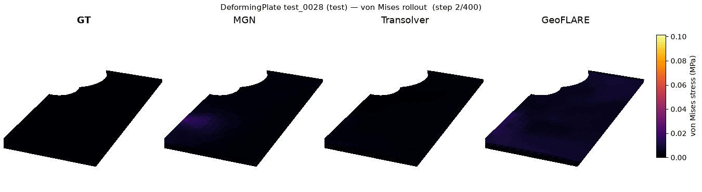
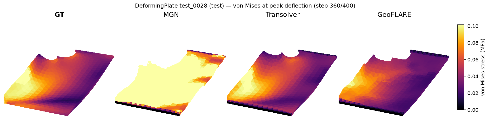

<!-- generated by tools/gen_benchmark_docs.py; do not edit by hand -->

# DeformingPlate — StructBench benchmark

## The problem

A rigid actuator presses into a soft hyperelastic plate, indenting it and
wrapping the sheet around the tool while a stress field builds through the
material. **DeformingPlate** is the 3D quasi-static benchmark from
MeshGraphNets (Pfaff et al. 2021): a tetrahedral plate held along one edge
(HANDLE nodes) and pushed by a scripted rigid obstacle, solved to static
equilibrium at each load step in COMSOL. It is StructBench's first 3D
benchmark and its first with an irregular, per-case mesh (672-2189 nodes) - a
test of whether a surrogate can cope with genuine 3D geometry, contact with a
moving tool, and a ragged node count, not just a fixed 2D lattice.

The task is an **autoregressive load-stepping rollout**: from a two-frame
prefix the model advances the mesh one pseudo-time step at a time to the end
of the trajectory (400 steps), predicting both the nodal displacement and the
per-node von Mises stress. Time here is a load-step index, not milliseconds -
the source solve is quasi-static (dt = 0 in the data).

## Cross-method comparison

DeformingPlate is where StructBench's headline is **method against method**.
MeshGraphNets is the *blessed* reference: its rollout reproduces the published
number (pooled position RMSE inside the reported band, ADR-0043), anchoring the
benchmark to a result the field already trusts. Against it run two provisional
native operators - **Transolver** (Physics-Attention) and **GeoFLARE**
(geometry-aware attention with a low-rank routing engine) - both adapted here
to autoregressive rollout (ADR-0044/0045). Everything is scored in physical
units - displacement RMSE in mm and the von Mises field in MPa, both **pooled
over space and time** to match the published DeformingPlate convention
(ADR-0043), not the mean-of-per-step RMSE used on the other benchmarks - with
two quantities of interest reading the engineering outcome: peak von Mises
stress and terminal peak deflection. On this smooth, quasi-static task the
operators' freedom from a fixed mesh graph tells: both outrun the mesh-based
reference on displacement (Transolver by ~3x on relative L2, ~4x on pooled
position RMSE), while MGN's stress field degrades under rollout. MGN's pooled
position RMSE (16.98 mm) still reproduces the published reference (15.1 +/-
4.0). The leaderboard is below.

## Figures



*Ground truth vs the three baselines (MGN, Transolver, GeoFLARE) on test_0028, the plate coloured by von Mises STRESS over the press-release rollout - the actuator indents to ~65 mm then retracts. Read the colour as a secondary, non-published field: MGN reproduces the paper's POSITION result faithfully (pooled rollout RMSE 16.98 mm, inside the 15.1 +/- 4.0 band and matching it at every horizon), but its stress degrades as the mesh drifts - it over-predicts through the press and stays stuck high when the plate releases and the true stress relaxes to near zero. That is a rollout-coupled artifact of the drifting mesh, not a broken model. Transolver's more stable rollout keeps its stress tracking ground truth throughout; GeoFLARE is between. Transolver and GeoFLARE are provisional native baselines (ADR-0044/0045).*



*von Mises STRESS at peak deflection (test_0028, step 360/400): ground truth vs MGN, Transolver, GeoFLARE. Stress is a non-published secondary here (the paper reports only position). MGN reproduces the paper's POSITION result faithfully - pooled rollout RMSE 16.98 mm, inside the 15.1 +/- 4.0 band and matching it at every horizon (rollout-50 2.1 vs 1.8 mm) - but its stress degrades under rollout: as the mesh drifts and locally over-stretches, the stress head reads the distorted geometry and over-predicts (relative L2 4.21). That is a rollout-coupled artifact, not a broken model - Transolver runs the identical stress pipeline and, with a more stable rollout, tracks ground truth almost exactly (relative L2 0.24); GeoFLARE (0.35) is between. Transolver and GeoFLARE are provisional native baselines (ADR-0044/0045).*

## Data at a glance

- Solver: COMSOL (FEM; erosion: no)
- Loading: Scripted rigid actuator (OBSTACLE nodes, kinematic); HANDLE nodes fixed
- Geometry: 3D tetrahedral mesh, ~0.5 m plate + rigid actuator; 672-2189 nodes per case (mean ~1270, ragged)
- Source units: kg-m-s (SI; measured 2026-08-08, ADR-0042 §2b) (canonical storage is strict SI, ADR-0012)
- Cases: 1200 (train 1000, val 100, test 100)
- Particles per case: 672-2189; 400 frames at 1.0 ms; 6.1 GB on disk
- Fields: node/displacement, node/von_mises_stress
- Provenance: MeshGraphNets dataset (Pfaff et al., ICLR 2021; COMSOL ground truth), downloaded from the DeepMind source bucket and converted locally to canonical HDF5 (ADR-0042; not redistributed).
- License: None stated by the source; downloaded from source, not redistributed (ADR-0042)

## Task

quasi-static load-stepping autoregressive rollout (ADR-0043). Auxiliary target: `von_mises_stress` (MPa). Models advance the particle state autoregressively from a short ground-truth prefix and are scored on the full predicted rollout.

## Evaluation criteria

- Protocol (benchmark-owned, ADR-0032, ADR-0035): 2 input frames, horizon full, scored at native output times.
- Metrics: headline is the pooled space+time relative L2 (displacement + von_mises_stress); also reported are position/von_mises_stress RMSE (physical units) and one-step RMSE, plus the quantities of interest below.
- Quantities of interest: peak_vm_stress, terminal_peak_deflection.

<details>
<summary>Protocol rationale — the ground-truth timeline analysis behind these values (ADR-0032 §5)</summary>

input_frames=2 is the floor (a velocity needs two frames) and the faithful value: the source model uses h=0 history — node inputs are the one-hot node type only — so no window tuning question exists and no ground-truth timeline analysis can move it (ADR-0043 §3). Pseudo-time: dt=0 in the source (quasi-static); time is the frame index and output_dt_ms=1.0 is nominal, not milliseconds. Units MEASURED on the full dataset (2026-08-08, ADR-0042 §2b): positions are metres, stress is Pa — so aux_unit MPa holds and kg-m-s is the identity source convention. Two measured caveats (ADR-0043 dated note): the hosted train.tfrecord carries 1,200 trajectories — the protocol's 1,000 are the first 1,000 in file order; and HANDLE (type-3) nodes are not strictly stationary in the data (max drift ~0.02 m train / ~0.06 m valid+test) — both kinematic types are GT-prescribed and excluded from scoring either way. Scored span is [2, 400), exclusive end (ADR-0043 §6).

</details>

## Leaderboard

The headline metric is the pooled space+time relative L2 (↓ lower is better); the Scheme column is the prediction scheme. RMSE and quantities of interest are shown for the in-distribution `test` split.

_Headline — pooled relative L2 (↓ better)_

| Method | Scheme | test·disp | test·aux |
|---|---|---|---|
| MGN | autoregressive | 0.8092 | 4.209 |
| Transolver | autoregressive | 0.2681 | 0.24 |
| GeoFLARE | autoregressive | 0.5729 | 0.3513 |

_Trajectory error — RMSE_

| Method | Scheme | test·pos (mm) | test·vm (MPa) |
|---|---|---|---|
| MGN | autoregressive | 16.98 | 0.1692 |
| Transolver | autoregressive | 4.282 | 0.01095 |
| GeoFLARE | autoregressive | 5.144 | 0.01493 |

_Quantities of interest (MAE)_

| Method | Scheme | test·peak_vm (MPa) | test·terminal_deflection (mm) |
|---|---|---|---|
| MGN | autoregressive | 2.94 | 47.39 |
| Transolver | autoregressive | 0.01915 | 6.172 |
| GeoFLARE | autoregressive | 0.03846 | 10.26 |

## Baseline details

**MGN** (mgn, 2026-08-15, commit `0f103b5`, checkpoint: `models/deforming_plate/mgn-0f103b5/model-best-2200000.pt` — private archive; publication parked)

*Native MeshGraphNets (ADR-0042/0043): autoregressive next-step on the 3D tetrahedral mesh with world edges (activation-checkpointed, commit 0f103b5). BLESSED: its POOLED test position RMSE, 16.98 mm (x10^-3 dataset-native length units; ADR-0043 paper convention, from tools/blessing_pooled_rmse.py), falls inside the published band 15.1 +/- 4.0 = [11.1, 19.1] that four later papers corroborate (ADR-0043), so it reproduces the reference deformation result the field trusts. Verified faithful at EVERY rollout horizon, not just the endpoint (rollout-50 2.10 mm vs the paper's 1.8 +/- 0.5; the whole growth curve tracks it), on a config that matches the paper exactly (noise 3e-3, batch 2, 128-wide / 15 message-passing, world radius 0.03 m). The pooled RMSE is dominated by a handful of divergent trajectories (per-case mean 10.2 mm, but a few cases run to 30-86 mm) - the honest whole-dataset statistic. The 10M-step blessing budget was cut at the val-selected 2.2M checkpoint (model-best-2200000.pt), in-band and plateaued (ADR-0043 dated note). Position is faithful, but the von Mises FIELD degrades under rollout: relative L2 4.21 (worse than a zero baseline on 96 of 100 cases), pooled von Mises RMSE 0.169 MPa. This is COUPLED to the rollout mesh distortion, NOT a stress-head bug: MGN's stress tracks GT early then over-predicts as the mesh drifts and locally over-stretches (max ~23x GT at peak, stuck high when the plate releases and true stress relaxes), while Transolver runs the identical aux pipeline and tracks stress almost exactly (relative L2 0.24). One-step von Mises RMSE 0.0081 MPa is fine. The published DeformingPlate result gates on position only and reports no stress number; stress is a StructBench secondary. Pooled relative L2 headline (ADR-0055) from the 2026-08-17 re-eval.*

**Transolver** (transolver, 2026-08-11, commit `84df162`)

*Native Transolver (Physics-Attention), provisional autoregressive adaptation on the DeformingPlate rollout (ADR-0044): a best-effort native implementation, not validated against a published Transolver-DeformingPlate number. Val-selected model-best-4000000.pt. It is the strongest baseline on this benchmark by a wide margin - ~3x lower displacement relative L2 than the blessed MGN (0.268 vs 0.809) and ~4x lower pooled position RMSE (4.28 vs 16.98 mm) - because its global attention is not tied to a fixed mesh graph and it accumulates little rollout error on smooth quasi-static deformation (von Mises relative L2 0.240 vs MGN 4.21). Pooled relative L2 headline (ADR-0055) from the 2026-08-17 re-eval.*

**GeoFLARE** (geoflare, 2026-08-14, commit `84df162`)

*Native GeoFLARE - GeoTransolver with the FLARE low-rank attention backend (attention_type GALE_FA) - provisional autoregressive adaptation on the DeformingPlate rollout (ADR-0045): a best-effort native implementation, not validated against a published number. Val-selected model-best-6600000.pt. It sits between Transolver and MGN: displacement relative L2 0.573 (vs Transolver 0.268, MGN 0.809) and pooled position RMSE 5.14 mm (vs MGN 16.98) - clearly beating the blessed reference but trailing the plain Physics-Attention operator on this task. Pooled relative L2 headline (ADR-0055) from the 2026-08-17 re-eval.*

## Quickstart

```bash
pip install structbench  # or: pip install -e . from the repo
structbench-train --mode train --config configs/deforming_plate/mgn.toml \
    --data-root /path/to/deforming_plate --out runs/deforming_plate-mgn
```

This config is the blessed baseline recipe verbatim, seed included — after training, `structbench-train --mode valid` and `--mode rollout` against the run directory regenerate the `metrics-<split>.json` files behind the numbers above (expect statistically similar rather than bit-identical numbers under GPU nondeterminism; the registry's checkpoint pointer and SHA-256 identify the exact blessed artifact).

Dataset access: the canonical archive is maintainer-held on institutional storage and shared on request (ADR-0040) — contact the maintainer, or ingest your own LS-DYNA output via the adapter; see the repository README. The cross-benchmark index is [docs/benchmarks.md](../benchmarks.md); machine-readable card metadata ships as `card.json` with the data archive.

## References

- **MGN** — Pfaff, T., Fortunato, M., Sanchez-Gonzalez, A., & Battaglia, P. W. (2021). Learning Mesh-Based Simulation with Graph Networks. *ICLR*. https://arxiv.org/abs/2010.03409
- **Transolver** — Wu, H., Luo, H., Wang, H., Wang, J., & Long, M. (2024). Transolver: A Fast Transformer Solver for PDEs on General Geometries. *ICML*. https://arxiv.org/abs/2402.02366
- **GeoFLARE** — Adams, R., et al. (NVIDIA). GeoTransolver. arXiv:2512.20399; with Puri, R., et al. FLARE: Fast Low-rank Attention Routing Engine. arXiv:2508.12594. GeoFLARE is GeoTransolver with the FLARE attention backend (attention_type GALE_FA; ADR-0045).
