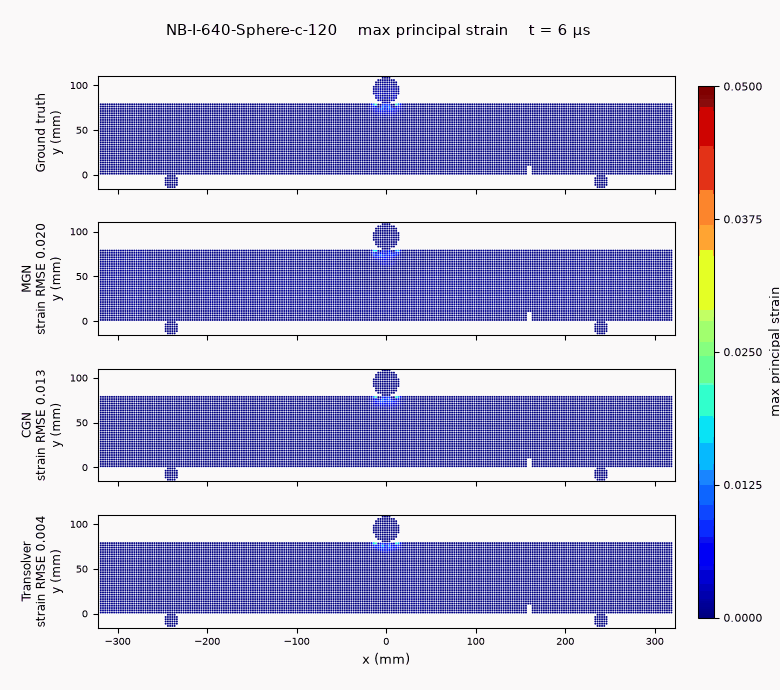
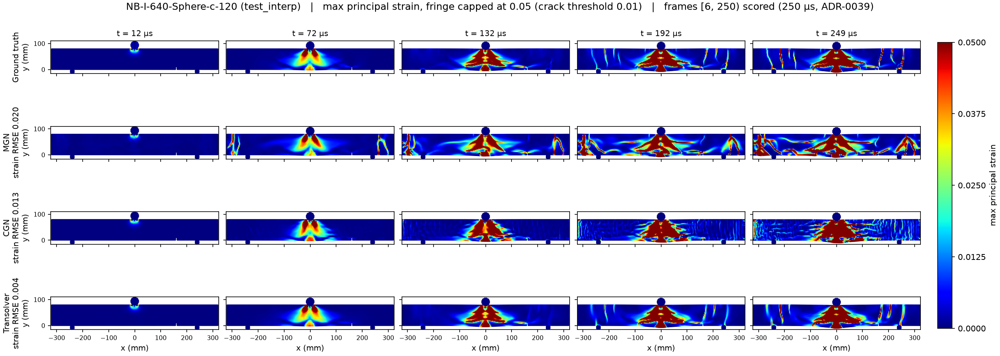

<!-- generated by tools/gen_benchmark_docs.py; do not edit by hand -->

# NotchBeam2D-Impact — StructBench benchmark

## The problem

A steel weight drops onto a **notched concrete beam** and the beam cracks: a
shear wedge punches down under the impactor while flexural cracks open from the
notch and race up through the section. Concrete under high-rate impact is a
brutal surrogate target — a quasi-brittle material that softens as it damages,
discrete cracks that localise strain, and a fracture pattern that *is* the
scientific quantity of interest rather than a by-product of the motion.

StructBench ships the 2D SPH version: an LS-DYNA `*MAT_CONCRETE_DAMAGE_REL3`
(K&C) notched beam, 80 mm deep and 320 / 480 / 640 mm span, struck at midspan by
a drop weight (Bullet / Rectangular / Sphere) at 40–160 m/s, with no element
erosion. The task is an **autoregressive next-step surrogate** — from a short
ground-truth prefix the model advances the SPH particle state one output step at
a time, predicting both position and the per-particle **max principal strain**,
the field that carries the crack pattern.

## Interpolation vs. the off-centre probe

`test_interp` holds out interior combinations of span, impactor shape, notch
position and velocity — every factor level still appears in training, so it
measures ordinary interpolation. The separate **probe** set is deliberately
harder: it is out-of-distribution on *three* axes at once — a new span, an
out-of-range velocity, and, decisively, an **off-centre impact** (every
in-distribution case is struck exactly at midspan). It measures graceful failure
on a genuinely new loading mode, not interpolation — and it is where the method
ordering flips (a global-attention operator that wins in-distribution
mis-localises the response there, while relative-position message passing
degrades more gracefully). Everything is scored over the 250 µs window (ADR-0039)
in physical units — position RMSE in mm, strain RMSE — plus two quantities of
interest: peak mid-span deflection and the end-state cracked fraction. The
numbers, and the cross-method comparison, are below.

## Figures



*Ground truth vs the three baselines (MGN, CGN, Transolver) on held-out NB-I-640-Sphere-c-120 (test_interp): a 640 mm span beam under 120 m/s sphere impact, coloured by max principal strain (fringe capped at 0.05, 5x the 1% crack threshold) over the 250 µs scored window. Transolver (time-conditioned) tracks the central shear wedge and the discrete flexural cracks most closely (rollout strain RMSE 0.004); CGN diffuses them into streaky bands (0.013); MGN is the diffusest (0.020).*



*In-distribution max-principal-strain snapshots (test_interp, 640 mm span, sphere at 120 m/s) at 12 / 72 / 132 / 192 / 249 µs across the scored window: ground truth vs MGN vs CGN vs Transolver. Transolver (rollout strain RMSE 0.004) reproduces the shear wedge and the discrete flexural cracks closely, while CGN (0.013) and MGN (0.020) smear them into diffuse streaky bands — the damage field, not the kinematics, is the open gap. MGN and Transolver are provisional native baselines (ADR-0044/0045).*

## Data at a glance

- Solver: LS-DYNA (SPH; erosion: no)
- Loading: drop-weight impact, initial velocity 40-160 m/s, impactor shapes Bullet/Rectangular/Sphere
- Geometry: 2D SPH notched beam, H80 x span {320,480,640} mm
- Source units: kg-mm-ms (canonical storage is strict SI, ADR-0012)
- Cases: 110 (train 88, val 8, test_interp 12, probe 2)
- Particles per case: 4264-12966; 502 frames at 0.001 ms; 24.9 GB on disk
- Fields: node/displacement, node/velocity, node/acceleration, sph/stress, sph/strain, sph/strain_rate, sph/effective_plastic_strain, sph/pressure, sph/density, sph/internal_energy, sph/mass, sph/radius, sph/n_neighbors, sph/deletion, global/kinetic_energy, global/internal_energy, global/total_energy
- Provenance: LS-DYNA parametric sweep (3 spans x 3 shapes x 3 notches x 4 velocities) produced by Curtin collaborators; benchmark protocol per ADR-0026.
- License: CC BY 4.0

## Task

autoregressive transition (ADR-0026). Auxiliary target: `max_principal_strain` (-). Models advance the particle state autoregressively from a short ground-truth prefix and are scored on the full predicted rollout.

## Evaluation criteria

- Protocol (benchmark-owned, ADR-0032, ADR-0035): 6 input frames, horizon frames [6, 250) of 502 scored (250 µs, ADR-0039); full-length diagnostic, scored at native output times.
- Metrics: headline is the pooled space+time relative L2 (displacement + max_principal_strain); also reported are position/max_principal_strain RMSE (physical units) and one-step RMSE, plus the quantities of interest below.
- Quantities of interest: midspan_deflection_peak, cracked_fraction.

<details>
<summary>Protocol rationale — the ground-truth timeline analysis behind these values (ADR-0032 §5)</summary>

Confirmed (maintainer, 2026-07-20): input_frames = 6 gives C = 5 input velocities (input_frames - 1), the GNS reference history length — the velocity budget is the criterion, not a rigid prefix. The timeline analysis (2026-07-20, on the DUG data copy) shows impact contact from frame 0, so the observed window takes in the first 6 us of contact; accepted. Scored horizon (ADR-0039): rollout metrics and QoIs are scored on frames [input_frames, 250) (250 µs). Internal energy reaches 99% of its final value by frame 77-213 (span-dependent); the remaining frames are ballistic separation and elastic ringing, which dominated full-horizon RMSE (half the final error accrued after frame 301 in baseline rollouts) while adding no fracture physics. The full 502-frame error curve remains a non-leaderboard long-horizon diagnostic. The cracked_fraction QoI threshold 0.01 is a declared protocol definition (ADR-0029, amended 2026-08-06): the SPH source model has no erosion or crack criterion; a 221-case sweep shows the GT fraction shifts ~0.05 mean per case across the factor-2 band [0.005, 0.02], and frame-249 vs frame-501 fractions are nearly identical (0.305 vs 0.317 mean), corroborating the 250 us horizon. Probe split (characterisation, 2026-08-15): the probe cases are out-of-distribution on THREE axes at once — span (400/800 mm) and impactor velocity both outside the training grids ({320,480,640} mm; {40,80,120,160} m/s), and, decisively, an OFF-CENTRE impact. All 108 train/val/test_interp cases are struck exactly at midspan (impact offset 0.0 mm, every notch a/b/c variant and span); the probe impacts land ~6% off-centre — a loading mode absent from training entirely. Probe scores therefore measure graceful failure on a genuinely new loading configuration, not ordinary interpolation: global-attention operators mis-localise the response to the learned midspan prior, while relative-position message-passing (MGN/CGN) degrades more gracefully.

</details>

## Leaderboard

The headline metric is the pooled space+time relative L2 (↓ lower is better); the Scheme column is the prediction scheme. RMSE and quantities of interest are shown for the in-distribution `test_interp` split.

_Headline — pooled relative L2 (↓ better)_

| Method | Scheme | interp·disp | interp·aux | probe·disp | probe·aux |
|---|---|---|---|---|---|
| MGN | autoregressive | 0.2245 | 0.6988 | 0.7672 | 1.255 |
| CGN | autoregressive | 0.2827 | 0.5876 | 0.5905 | 0.8535 |
| Transolver | time-conditioned | 0.03517 | 0.2294 | 1.047 | 1.236 |

_Trajectory error — RMSE_

| Method | Scheme | interp·pos (mm) | interp·strain |
|---|---|---|---|
| MGN | autoregressive | 0.1984 | 0.01997 |
| CGN | autoregressive | 0.2497 | 0.01697 |
| Transolver | time-conditioned | 0.03365 | 0.006467 |

_Quantities of interest (MAE)_

| Method | Scheme | interp·midspan_deflection_peak (mm) | interp·cracked_fraction |
|---|---|---|---|
| MGN | autoregressive | 0.5842 | 0.1081 |
| CGN | autoregressive | 0.5843 | 0.1892 |
| Transolver | time-conditioned | 0.04067 | 0.0212 |

## Baseline details

**MGN** (mgn, 2026-08-17, commit `59d5786`)

*Native MeshGraphNets (ADR-0047 baseline, ADR-0049 repair): autoregressive next-step on the SPH particle set as a mesh, val-selected model-best-212000.pt, seed 2 of the s1-s2 pair, run notch-mgn-base-s2. PROVISIONAL (ADR-0044/0045). On test_interp it roughly matches CGN (displacement relative L2 0.22 vs 0.28) and both trail Transolver ~6x; on the off-centre triple-OOD PROBE the relative-position message passing degrades more gracefully than the global-attention operator (disp 0.77 vs Transolver 1.05), though CGN is best there (0.59). Pooled relative L2 headline (ADR-0055) from the 2026-08-17 re-eval.*

**CGN** (cgn, 2026-07-24, commit `5956d81`, checkpoint: `models/notch_beam_2d_impact/cgn-5956d81/model-best-186000.pt` — private archive; publication parked)

*Single-scale CGN (ADR-0034) on the ADR-0039 §4 truncated recipe with the ADR-0038 strain knobs (train_frames 250, aux_tail_weight 3, asinh aux transform at scale 0.01; hidden 192 / 15 MP steps / 2-layer node MLP, noise_std 0.01, batch 4) at 250k steps; seed 1 of the 2026-07-24 h250c pair (seeds 1-2), val-selected checkpoint model-best-186000.pt (186k), one A100-80GB, ~80 h. Extending the same recipe from 200k to 250k steps cut seed-mean test rollout position RMSE 21% and deflection MAE 30% while validation strain RMSE stayed flat (0.0173 -> 0.0163): the extra budget buys kinematics, not damage-field quality. Caveats: the model over-predicts cracked fraction on the reviewed cases (crack MAE 0.19 vs sibling seed s2's 0.13, the one metric s2 wins); the off-grid probe case S_80_400_V140 is this seed's worst rollout (0.59 mm scored vs 0.40 for s2); predictions break the mirror symmetry of centered-notch cases while the ground truth stays symmetric (2026-07-24 finding); full-horizon (502-frame) rollout position RMSE is 0.87 mm on test_interp - diagnostic only, not scored. Relative L2 (rollout_rel_l2_disp/aux) is the pooled space+time headline (ADR-0055), added 2026-08-16 from a re-eval on this checkpoint; RMSE reproduced to <1%, so the blessed RMSE/QoI values are unchanged.*

**Transolver** (transolver, 2026-08-16, commit `59d5786`)

*Native time-conditioned Transolver (ADR-0054): history-free independent-time-query, no rollout accumulation, so one-step is N/A. Seed 2 of the s1-s2 pair, val-selected model-best-230000.pt, run notch-transolver-tc-s2. PROVISIONAL (ADR-0044/0045). On test_interp it is the strongest baseline (~8x lower displacement relative L2 than CGN); on the PROBE it fails hard (relative L2 > 1) - the off-centre triple-OOD case (ADR-0026 amendment) where the global-attention operator mis-localises the response to the learned midspan prior, while CGN's relative-position message passing degrades more gracefully (probe disp 0.59 vs 1.05). Pooled relative L2 headline (ADR-0055) from the 2026-08-16 re-eval.*

## Quickstart

```bash
pip install structbench  # or: pip install -e . from the repo
structbench-train --mode train --config configs/notch_beam_2d_impact/cgn.toml \
    --data-root /path/to/notch_beam_2d_impact --out runs/notch_beam_2d_impact-cgn
```

This config is the blessed baseline recipe verbatim, seed included — after training, `structbench-train --mode valid` and `--mode rollout` against the run directory regenerate the `metrics-<split>.json` files behind the numbers above (expect statistically similar rather than bit-identical numbers under GPU nondeterminism; the registry's checkpoint pointer and SHA-256 identify the exact blessed artifact).

Dataset access: the canonical archive is maintainer-held on institutional storage and shared on request (ADR-0040) — contact the maintainer, or ingest your own LS-DYNA output via the adapter; see the repository README. The cross-benchmark index is [docs/benchmarks.md](../benchmarks.md); machine-readable card metadata ships as `card.json` with the data archive.

## References

- **MGN** — Pfaff, T., Fortunato, M., Sanchez-Gonzalez, A., & Battaglia, P. W. (2021). Learning Mesh-Based Simulation with Graph Networks. *ICLR*. https://arxiv.org/abs/2010.03409
- **CGN** — Li, Q., Wang, Z., Li, L., Hao, H., Chen, W., & Shao, Y. (2023). Machine learning prediction of structural dynamic responses using graph neural networks. *Computers & Structures*, 289, 107188. https://doi.org/10.1016/j.compstruc.2023.107188
- **Transolver** — Wu, H., Luo, H., Wang, H., Wang, J., & Long, M. (2024). Transolver: A Fast Transformer Solver for PDEs on General Geometries. *ICML*. https://arxiv.org/abs/2402.02366
