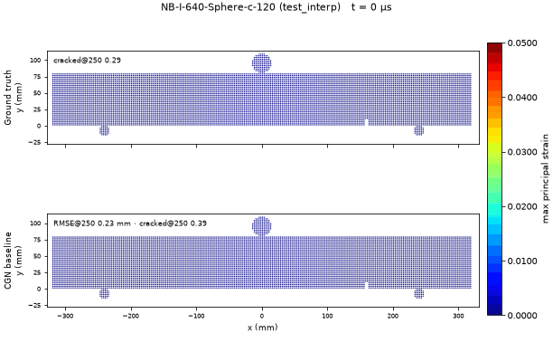
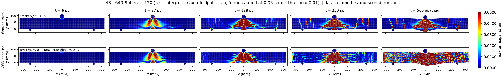
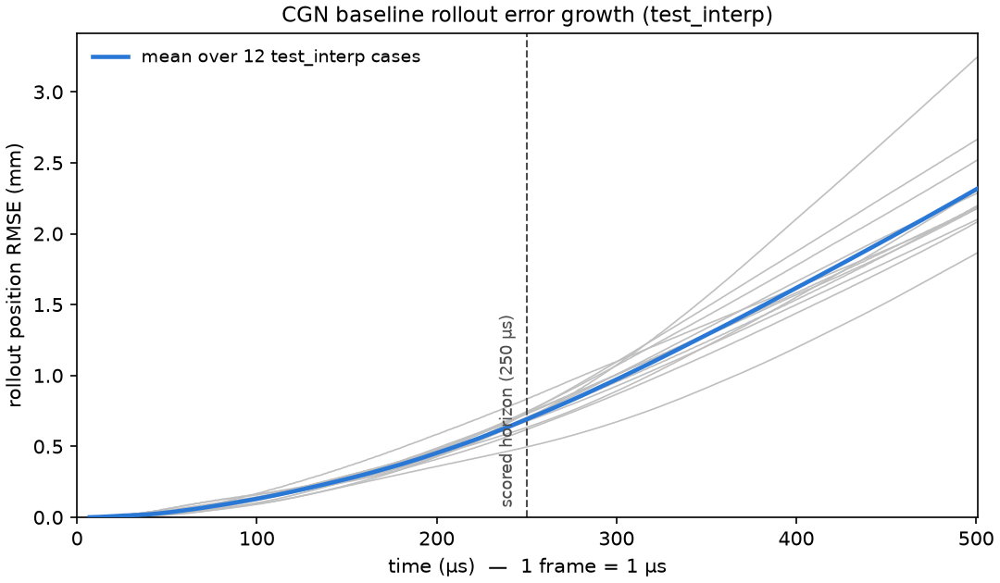

<!-- generated by tools/gen_benchmark_docs.py; do not edit by hand -->

# NotchBeam2D-Impact — StructBench benchmark

## Figures



*Ground truth (top) vs CGN prediction (bottom) on held-out NB-I-640-Sphere-c-120 (test_interp): a 640 mm span beam under 120 m/s sphere impact, coloured by max principal strain (fringe capped at 0.05, 5x the 1% crack threshold). The surrogate tracks the impact wedge and beam deflection through the 250 µs scored window; the marked frames beyond it are the unscored long-horizon diagnostic, where the prediction visibly degrades.*



*In-distribution snapshots (test_interp, 640 mm span, sphere at 120 m/s): ground truth (top) vs CGN baseline (bottom) at four scored-window times plus the beyond-horizon diagnostic frame. The model follows the central shear wedge and the deflection but diffuses the discrete flexural cracks into streaky bands and over-counts cracked fraction (0.39 vs 0.29 at 250 µs) — the damage field, not the kinematics, is the open gap.*



*Per-frame rollout position RMSE for the 12 test_interp cases (gray) and their mean (blue). Error grows smoothly to ~0.7 mm at the 250 µs scored horizon (dashed) and keeps growing to ~2.3 mm over the full 502-frame record — the ballistic-separation and ringing tail the ADR-0039 horizon deliberately excludes from scoring.*

## Data at a glance

- Solver: LS-DYNA (SPH; erosion: no)
- Loading: drop-weight impact, initial velocity 40-160 m/s, impactor shapes Bullet/Rectangular/Sphere
- Geometry: 2D SPH notched beam, H80 x span {320,480,640} mm
- Source units: kg-mm-ms (canonical storage is strict SI, ADR-0012)
- Cases: 110 (train 88, val 8, test_interp 12, probe 2)
- Particles per case: 4264-12966; 502 frames at 0.001 ms; 24.9 GB on disk
- Fields: node/displacement, node/velocity, node/acceleration, sph/stress, sph/strain, sph/strain_rate, sph/effective_plastic_strain, sph/pressure, sph/density, sph/internal_energy, sph/mass, sph/radius, sph/n_neighbors, sph/deletion, global/kinetic_energy, global/internal_energy, global/total_energy
- Provenance: LS-DYNA parametric sweep (3 spans x 3 shapes x 3 notches x 4 velocities) produced by Curtin collaborators; benchmark protocol per ADR-0026.
- License: CC BY 4.0

## Task

autoregressive transition (ADR-0026). Auxiliary target: `max_principal_strain` (-). Models advance the particle state autoregressively from a short ground-truth prefix and are scored on the full predicted rollout.

## Evaluation criteria

- Protocol (benchmark-owned, ADR-0032, ADR-0035): 6 input frames, horizon frames [6, 250) of 502 scored (250 µs, ADR-0039); full-length diagnostic, scored at native output times.
- Metrics: one-step and full-rollout position RMSE (mm); max_principal_strain RMSE (-).
- Quantities of interest: midspan_deflection_peak, cracked_fraction.

<details>
<summary>Protocol rationale — the ground-truth timeline analysis behind these values (ADR-0032 §5)</summary>

Confirmed (maintainer, 2026-07-20): input_frames = 6 gives C = 5 input velocities (input_frames - 1), the GNS reference history length — the velocity budget is the criterion, not a rigid prefix. The timeline analysis (2026-07-20, on the DUG data copy) shows impact contact from frame 0, so the observed window takes in the first 6 us of contact; accepted. Scored horizon (ADR-0039): rollout metrics and QoIs are scored on frames [input_frames, 250) (250 µs). Internal energy reaches 99% of its final value by frame 77-213 (span-dependent); the remaining frames are ballistic separation and elastic ringing, which dominated full-horizon RMSE (half the final error accrued after frame 301 in baseline rollouts) while adding no fracture physics. The full 502-frame error curve remains a non-leaderboard long-horizon diagnostic. The cracked_fraction QoI threshold 0.01 is a declared protocol definition (ADR-0029, amended 2026-08-06): the SPH source model has no erosion or crack criterion; a 221-case sweep shows the GT fraction shifts ~0.05 mean per case across the factor-2 band [0.005, 0.02], and frame-249 vs frame-501 fractions are nearly identical (0.305 vs 0.317 mean), corroborating the 250 us horizon.

</details>

## Numbers to beat

**CGN baseline** (cgn, 2026-07-24, commit `5956d81`, checkpoint: `models/notch_beam_2d_impact/cgn-5956d81/model-best-186000.pt` — private archive; publication parked)

_Trajectory error (RMSE)_

| split | rollout_pos_rmse_mm | rollout_strain_rmse | one_step_pos_rmse_mm | one_step_strain_rmse |
|---|---|---|---|---|
| test_interp | 0.2497 | 0.01697 | 0.0006992 | 0.0006181 |
| probe | 0.3951 | 0.01931 | 0.0006437 | 0.0009397 |

_Quantities of interest (MAE)_

| split | qoi_midspan_deflection_peak_mae_mm | qoi_cracked_fraction_mae |
|---|---|---|
| test_interp | 0.5843 | 0.1892 |
| probe | 1.337 | 0.186 |

*Single-scale CGN (ADR-0034) on the ADR-0039 §4 truncated recipe with the ADR-0038 strain knobs (train_frames 250, aux_tail_weight 3, asinh aux transform at scale 0.01; hidden 192 / 15 MP steps / 2-layer node MLP, noise_std 0.01, batch 4) at 250k steps; seed 1 of the 2026-07-24 h250c pair (seeds 1-2), val-selected checkpoint model-best-186000.pt (186k), one A100-80GB, ~80 h. Extending the same recipe from 200k to 250k steps cut seed-mean test rollout position RMSE 21% and deflection MAE 30% while validation strain RMSE stayed flat (0.0173 -> 0.0163): the extra budget buys kinematics, not damage-field quality. Caveats: the model over-predicts cracked fraction on the reviewed cases (crack MAE 0.19 vs sibling seed s2's 0.13, the one metric s2 wins); the off-grid probe case S_80_400_V140 is this seed's worst rollout (0.59 mm scored vs 0.40 for s2); predictions break the mirror symmetry of centered-notch cases while the ground truth stays symmetric (2026-07-24 finding); full-horizon (502-frame) rollout position RMSE is 0.87 mm on test_interp - diagnostic only, not scored.*

## Quickstart

```bash
pip install structbench  # or: pip install -e . from the repo
structbench-train --mode train --config configs/notch_beam_2d_impact/cgn.toml \
    --data-root /path/to/notch_beam_2d_impact --out runs/notch_beam_2d_impact-cgn
```

This config is the blessed baseline recipe verbatim, seed included — after training, `structbench-train --mode valid` and `--mode rollout` against the run directory regenerate the `metrics-<split>.json` files behind the numbers above (expect statistically similar rather than bit-identical numbers under GPU nondeterminism; the registry's checkpoint pointer and SHA-256 identify the exact blessed artifact).

Dataset access: the canonical archive is maintainer-held on institutional storage and shared on request (ADR-0040) — contact the maintainer, or ingest your own LS-DYNA output via the adapter; see the repository README. The cross-benchmark index is [docs/benchmarks.md](../benchmarks.md); machine-readable card metadata ships as `card.json` with the data archive.
