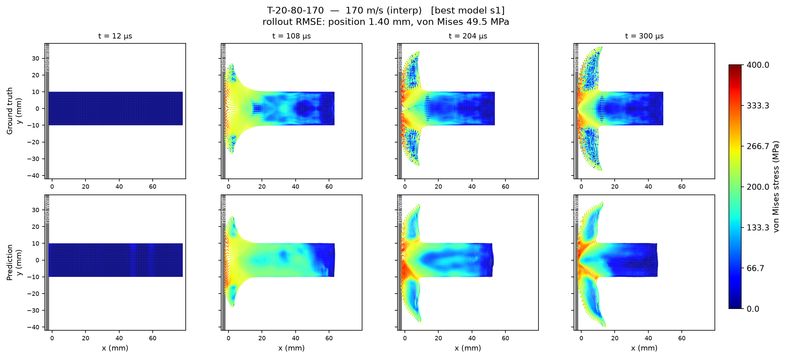
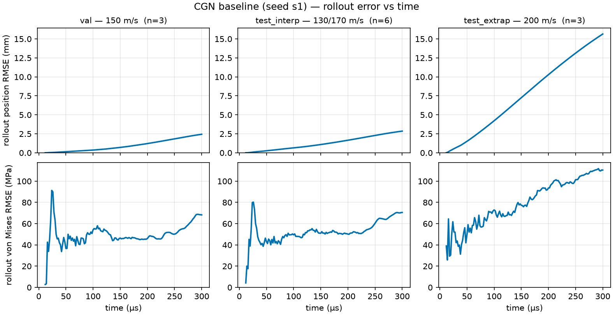

<!-- generated by tools/gen_benchmark_docs.py; do not edit by hand -->

# Taylor2D-Impact — StructBench benchmark

## The problem

A copper bar strikes a rigid wall head-on and *mushrooms*: the impact face
spreads outward while a plastic wave runs back up the bar. The **Taylor impact
test** is a classic high-strain-rate experiment for calibrating elasto-plastic
material models, and it makes a demanding learned-surrogate target — large
plastic deformation, a travelling stress front, strain-hardening flow with a
pressure–volume equation of state, and a moving contact boundary, all inside
~300 microseconds.

StructBench ships the 2D SPH version: an LS-DYNA `*MAT_ELASTIC_PLASTIC_HYDRO`
+ `*EOS_GRUNEISEN` copper bar, 20 mm wide and 60 / 80 / 100 mm long, fired at
a rigid wall at 100–200 m/s. The task is an **autoregressive next-step
surrogate** — from a short ground-truth prefix the model advances the particle
state one output step at a time to the end of the trajectory, predicting both
position and the per-particle von Mises stress.

## Interpolation vs. extrapolation

The split varies **only the impact velocity** across the three fixed
geometries, cleanly separating the two regimes a surrogate should be judged
on: `test_interp` (130 / 170 m/s) sits inside the training band, while
`test_extrap` (200 m/s) sits beyond it; `val` (150 m/s) only picks each run's
checkpoint. Everything is scored in physical units — position RMSE in mm, the
von Mises field in MPa — and four quantities of interest read the engineering
outcome directly: final bar length, mushroom width, and the peak mean von
Mises stress with its timing. The reference CGN baseline is strong in
interpolation and degrades honestly at 200 m/s; the numbers are below.

## Figures


*Ground truth (left) vs CGN prediction (right) at 150 m/s (in-distribution), a 20x80 mm copper bar coloured by von Mises stress. The surrogate tracks the mushroom head, bar shortening, and impact-face stress band frame by frame over the 300 us rollout.*



*In-distribution (test_interp, 170 m/s): ground truth (top) vs CGN prediction (bottom), von Mises stress at 12 / 108 / 204 / 300 us. The prediction reproduces the mushroom head, bar shortening, and the impact-face high-stress band; its stress field is slightly smoother and more diffuse than ground truth but structurally faithful (rollout position RMSE 1.4 mm).*



*Rollout error vs time for the CGN baseline (seed s1): position RMSE (top) and von Mises RMSE (bottom), case-averaged across val / interp / extrap. Position error accumulates monotonically; the von Mises error spikes at first wall contact (~20-40 us) then re-grows. Extrapolation to 200 m/s is where it blows up.*

## Data at a glance

- Solver: LS-DYNA (SPH; erosion: no)
- Loading: rigid-wall impact; initial velocity 100-200 m/s
- Geometry: 2D bar, 20 mm x {60, 80, 100} mm
- Source units: g-mm-ms (canonical storage is strict SI, ADR-0012)
- Cases: 33 (train 21, val 3, test_interp 6, test_extrap 3)
- Particles per case: 4800-8000; 152 frames at 0.002 ms; 2.4 GB on disk
- Fields: node/displacement, node/velocity, node/acceleration, sph/stress, sph/strain, sph/strain_rate, sph/effective_plastic_strain, sph/pressure, sph/density, sph/internal_energy, sph/mass, sph/radius, sph/n_neighbors, sph/deletion, global/kinetic_energy, global/internal_energy, global/total_energy
- Provenance: LS-DYNA parametric sweep (3 bar lengths x 11 impact velocities) produced by Curtin collaborators; benchmark protocol per ADR-0019. One extra Convergence run is held aside for a mesh-resolution check.
- License: CC BY 4.0

## Task

autoregressive transition (ADR-0019). Auxiliary target: `von_mises_stress` (MPa). Models advance the particle state autoregressively from a short ground-truth prefix and are scored on the full predicted rollout.

## Evaluation criteria

- Protocol (benchmark-owned, ADR-0032, ADR-0035): 6 input frames, horizon full, scored at native output times.
- Metrics: one-step and full-rollout position RMSE (mm); von_mises_stress RMSE (MPa).
- Quantities of interest: final_length, mushroom_width, peak_von_mises, t_peak_von_mises.

<details>
<summary>Protocol rationale — the ground-truth timeline analysis behind these values (ADR-0032 §5)</summary>

input_frames = 6 gives the model C = 5 input velocities (input_frames - 1), the GNS reference history length (Sanchez-Gonzalez et al. 2023); under ADR-0035 the model observes exactly these 6 ground-truth frames to seed the rollout, with no constant-velocity history backfill. GT timeline analysis over all 33 cases (2026-07-05, python -m structbench.benchmarks.timeline; evidence table in docs/timelines/taylor_impact_2d.md): the rod is in free flight until first wall contact near frame 7, so a 6-frame observed prefix takes in 0.0% of the impact in every case, while the historical init = 11 handed models the shock onset (up to 10.6% of total KE already dissipated; nonzero in every case above 100 m/s). 99% displacement settlement lands as late as 296 us of the 300 us record and the last fifth of the horizon retains 1.6-8.1% of peak mean acceleration (elastic ringing), so the full horizon is dynamically active. n_frames = 152 counts stored frames; the working trajectory drops the terminal solver-output artifact frame (ADR-0028), giving a 151-frame / 300 us protocol horizon and a scored span of frames [6, 151) -- 145 predicted frames. Predictions are scored at the native 2 us output times; peak_von_mises/t_peak_von_mises (peak of the particle-mean field, e.g. 191 MPa at 44 us in T-20-80-150 ground truth) penalize temporally coarse surrogates.

</details>

## Numbers to beat

**CGN baseline** (cgn, 2026-07-08, commit `7be9d4b`, checkpoint: `models/taylor_impact_2d/cgn-7be9d4b/model-best-096000.pt` — private archive; publication parked)

_Trajectory error (RMSE)_

| split | rollout_pos_rmse_mm | rollout_vm_rmse_mpa | one_step_pos_rmse_mm | one_step_vm_rmse_mpa |
|---|---|---|---|---|
| test_interp | 1.274 | 52.57 | 0.003244 | 36.09 |
| test_extrap | 7.645 | 79.46 | 0.004649 | 40.43 |

_Quantities of interest (MAE)_

| split | qoi_final_length_mae_mm | qoi_mushroom_width_mae_mm | qoi_peak_vm_mae_mpa | qoi_t_peak_vm_mae_ms |
|---|---|---|---|---|
| test_interp | 3.083 | 4.754 | 2.865 | 0.003993 |
| test_extrap | 3.198 | 11.59 | 19.21 | 0.2293 |

*Single-scale CGN (ADR-0034) on the ADR-0028 recipe at 100k steps, seed 1 of the s0-s3 fleet; val-selected checkpoint model-best-096000.pt (96k), one A100-80GB, ~22.4 h. s1 is the best von Mises seed (lowest rollout aux RMSE on val and test_interp) and the seed behind the published qualitative rollouts; on rollout position it is the best of four on test_interp and the most conservative (highest) on test_extrap. Extrapolation to 200 m/s is the benchmark's honest failure mode: rollout position degrades ~6x against test_interp.*

## Quickstart

```bash
pip install structbench  # or: pip install -e . from the repo
structbench-train --mode train --config configs/taylor_impact_2d/cgn.toml \
    --data-root /path/to/taylor_impact_2d --out runs/taylor_impact_2d-cgn
```

This config is the blessed baseline recipe verbatim, seed included — after training, `structbench-train --mode valid` and `--mode rollout` against the run directory regenerate the `metrics-<split>.json` files behind the numbers above (expect statistically similar rather than bit-identical numbers under GPU nondeterminism; the registry's checkpoint pointer and SHA-256 identify the exact blessed artifact).

Dataset download and hosting: see the repository README. The cross-benchmark index is [docs/benchmarks.md](../benchmarks.md); machine-readable card metadata ships as `card.json` with the data archive.
