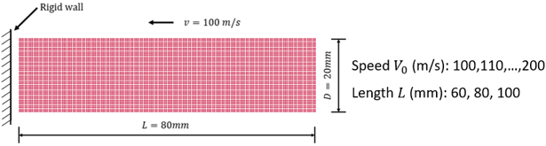
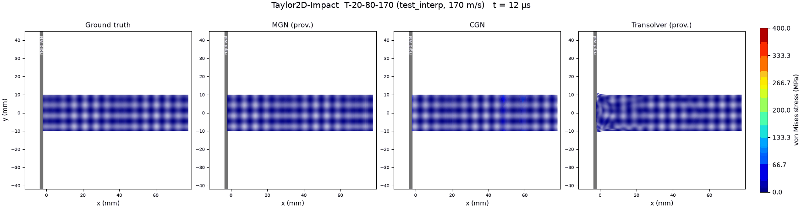
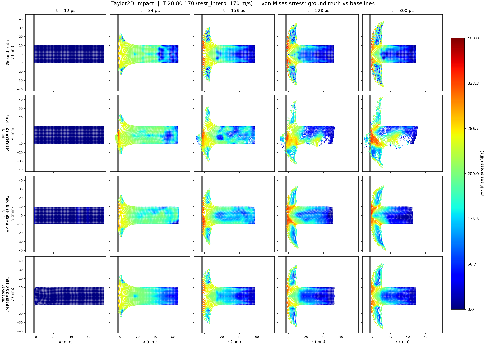

<!-- generated by tools/gen_benchmark_docs.py; do not edit by hand -->

# Taylor2D-Impact — StructBench benchmark

## The problem

A copper bar strikes a rigid wall head-on and *mushrooms*: the impact face
spreads outward while a plastic wave runs back up the bar. The **Taylor impact
test** is a classic high-strain-rate experiment for calibrating elasto-plastic
material models, and it makes a demanding learned-surrogate target — large
plastic deformation, a travelling stress front, strain-hardening flow with a
pressure–volume equation of state, and a moving contact boundary, all inside
~300 microseconds.

StructBench ships the 2D SPH version: an LS-DYNA `*MAT_ELASTIC_PLASTIC_HYDRO`
+ `*EOS_GRUNEISEN` copper bar, 20 mm wide and 60 / 80 / 100 mm long, fired at
a rigid wall at 100–200 m/s. The task is an **autoregressive next-step
surrogate** — from a short ground-truth prefix the model advances the particle
state one output step at a time to the end of the trajectory, predicting both
position and the per-particle von Mises stress.



*Problem setup: a copper bar (D = 20 mm, L = 60 / 80 / 100 mm) fired head-on
at a rigid wall at 100–200 m/s.*

## Interpolation vs. extrapolation

The split varies **only the impact velocity** across the three fixed
geometries, cleanly separating the two regimes a surrogate should be judged
on: `test_interp` (130 / 170 m/s) sits inside the training band, while
`test_extrap` (200 m/s) sits beyond it; `val` (150 m/s) only picks each run's
checkpoint. Everything is scored in physical units — position RMSE in mm, the
von Mises field in MPa — and four quantities of interest read the engineering
outcome directly: final bar length, mushroom width, and the peak mean von
Mises stress with its timing. The reference CGN baseline is strong in
interpolation and degrades honestly at 200 m/s; the numbers are below.

## The von Mises stress floor

The per-particle von Mises field carries an irreducible, model-independent
noise floor, and the aux numbers should be read with it in mind. At the
particle scale, the raw von Mises field differs from its own 12-neighbour
smoothed version by ~0.12 relative L2 — sub-particle jitter from the SPH
discretisation (tensile instability, particle disorder) that no surrogate
should be expected to reproduce. The field is also not fully converged at the
benchmark resolution: the same case re-run at 4x finer resolution differs by
~0.27 relative L2 (an over-estimate, since the finer field carries its own
particle noise). The strongest baselines report von Mises relative L2 ~0.17,
only ~0.06 above the particle-scale floor — so the achievable headroom on this
field is small, and a von Mises relative L2 much below ~0.12 is fitting
discretisation noise, not signal. This is a property of the DATA, not any one
model: it is why displacement (relative L2 ~0.009) is ~20x more predictable
than stress here, and it is why a spatially-smoothed von Mises companion metric
(which removes the sub-particle noise) is the fairer reading of stress accuracy
on this benchmark.

## Figures



*Ground truth vs the three baselines (CGN, Transolver, MGN) on T-20-80-170 (test_interp, 170 m/s), a 20x80 mm copper bar coloured by von Mises stress over the scored rollout. Transolver (time-conditioned) tracks the mushroom-head stress band most closely; CGN is slightly diffuse in the interior; MGN smears and fragments the field and its particles penetrate the rigid wall. Transolver and MGN are provisional native baselines (ADR-0044/0045).*



*In-distribution von Mises stress (T-20-80-170, test_interp, 170 m/s): ground truth vs the three baselines at 12 / 84 / 156 / 228 / 300 us. Transolver tracks the mushroom-head stress band most closely (rollout von Mises RMSE 30 MPa); CGN is slightly diffuse (49.5 MPa); MGN smears and fragments the field (62.4 MPa) - the ranking the leaderboard reports. Transolver and MGN are provisional (ADR-0044/0045).*

## Data at a glance

- Solver: LS-DYNA (SPH; erosion: no)
- Loading: rigid-wall impact; initial velocity 100-200 m/s
- Geometry: 2D bar, 20 mm x {60, 80, 100} mm
- Source units: g-mm-ms (canonical storage is strict SI, ADR-0012)
- Cases: 33 (train 21, val 3, test_interp 6, test_extrap 3)
- Particles per case: 4800-8000; 152 frames at 0.002 ms; 2.4 GB on disk
- Fields: node/displacement, node/velocity, node/acceleration, sph/stress, sph/strain, sph/strain_rate, sph/effective_plastic_strain, sph/pressure, sph/density, sph/internal_energy, sph/mass, sph/radius, sph/n_neighbors, sph/deletion, global/kinetic_energy, global/internal_energy, global/total_energy
- Provenance: LS-DYNA parametric sweep (3 bar lengths x 11 impact velocities) produced by Curtin collaborators; benchmark protocol per ADR-0019. One extra Convergence run is held aside for a mesh-resolution check.
- License: CC BY 4.0
- Data: maintainer-held, shared on request (ADR-0040)

## Task

autoregressive transition (ADR-0019). Auxiliary target: `von_mises_stress` (MPa). Models advance the particle state autoregressively from a short ground-truth prefix and are scored on the full predicted rollout.

## Evaluation criteria

- Protocol (benchmark-owned, ADR-0032, ADR-0035): 6 input frames, horizon full, scored at native output times.
- Metrics: headline is the pooled space+time relative L2 (displacement + von_mises_stress); also reported are position/von_mises_stress RMSE (physical units) and one-step RMSE, plus the quantities of interest below.
- Quantities of interest: final_length, mushroom_width, peak_von_mises, t_peak_von_mises.

<details>
<summary>Protocol rationale — the ground-truth timeline analysis behind these values (ADR-0032 §5)</summary>

input_frames = 6 gives the model C = 5 input velocities (input_frames - 1), the GNS reference history length (Sanchez-Gonzalez et al. 2023); under ADR-0035 the model observes exactly these 6 ground-truth frames to seed the rollout, with no constant-velocity history backfill. GT timeline analysis over all 33 cases (2026-07-05, python -m structbench.benchmarks.timeline; evidence table in docs/timelines/taylor_impact_2d.md): the rod is in free flight until first wall contact near frame 7, so a 6-frame observed prefix takes in 0.0% of the impact in every case, while the historical init = 11 handed models the shock onset (up to 10.6% of total KE already dissipated; nonzero in every case above 100 m/s). 99% displacement settlement lands as late as 296 us of the 300 us record and the last fifth of the horizon retains 1.6-8.1% of peak mean acceleration (elastic ringing), so the full horizon is dynamically active. n_frames = 152 counts stored frames; the working trajectory drops the terminal solver-output artifact frame (ADR-0028), giving a 151-frame / 300 us protocol horizon and a scored span of frames [6, 151) -- 145 predicted frames. Predictions are scored at the native 2 us output times; peak_von_mises/t_peak_von_mises (peak of the particle-mean field, e.g. 191 MPa at 44 us in T-20-80-150 ground truth) penalize temporally coarse surrogates.

</details>

## Leaderboard

The headline metric is the pooled space+time relative L2 (↓ lower is better); the Scheme column is the prediction scheme. RMSE and quantities of interest are shown for the in-distribution `test_interp` split.

_Headline — pooled relative L2 (↓ better)_

| Method | Scheme | interp·disp | interp·aux | extrap·disp | extrap·aux |
|---|---|---|---|---|---|
| MGN | autoregressive | 0.21570 | 0.34560 | 0.32330 | 0.43270 |
| CGN | autoregressive | 0.12990 | 0.32230 | 0.55470 | 0.45310 |
| Transolver | autoregressive | 0.02133 | 0.22110 | 0.04184 | 0.19590 |
| Transolver | time-conditioned | 0.00938 | 0.17490 | 0.01637 | 0.19820 |
| Transolver++ | time-conditioned | 0.00936 | 0.17330 | 0.01765 | 0.19320 |

_Trajectory error — RMSE_

| Method | Scheme | interp·pos (mm) | interp·vm (MPa) |
|---|---|---|---|
| MGN | autoregressive | 2.27200 | 55.79000 |
| CGN | autoregressive | 1.27400 | 52.57000 |
| Transolver | autoregressive | 0.21510 | 33.83000 |
| Transolver | time-conditioned | 0.10430 | 28.56000 |
| Transolver++ | time-conditioned | 0.10450 | 28.28000 |

_Quantities of interest (MAE)_

| Method | Scheme | interp·final_length (mm) | interp·mushroom_width (mm) | interp·peak_vm (MPa) | interp·t_peak_vm (ms) |
|---|---|---|---|---|---|
| MGN | autoregressive | 9.10800 | 6.09700 | 3.63900 | 0.00134 |
| CGN | autoregressive | 3.08300 | 4.75400 | 2.86500 | 0.00399 |
| Transolver | autoregressive | 0.57490 | 0.76860 | 1.11000 | 0.00367 |
| Transolver | time-conditioned | 0.55570 | 0.35320 | 2.16400 | 0.00199 |
| Transolver++ | time-conditioned | 0.64280 | 0.33180 | 2.10300 | 0.00132 |

## Baseline details

**MGN** (mgn, 2026-08-16, commit `d838606`)

*Native MeshGraphNets (ADR-0047 baseline, ADR-0049 repair): autoregressive next-step on the SPH particle set as a mesh, val-selected model-best-066000.pt, seed 1 of the s1-s2 pair, run taylor-mgn-base-s1. PROVISIONAL (ADR-0044/0045): not validated against a published Taylor-MGN number. On Taylor it TRAILS the CGN baseline (rollout position 2.27 vs 1.27 mm on test_interp; displacement relative L2 0.22 vs 0.13) - the known MGN-on-Taylor difficulty (large mesh stretch, noise-scale sensitivity; ADR-0047). Pooled relative L2 headline (ADR-0055) from the 2026-08-16 re-eval.*

**CGN** (cgn, 2026-07-08, commit `7be9d4b`, checkpoint: `models/taylor_impact_2d/cgn-7be9d4b/model-best-096000.pt` — private archive; publication parked)

*Single-scale CGN (ADR-0034) on the ADR-0028 recipe at 100k steps, seed 1 of the s0-s3 fleet; val-selected checkpoint model-best-096000.pt (96k), one A100-80GB, ~22.4 h. s1 is the best von Mises seed (lowest rollout aux RMSE on val and test_interp) and the seed behind the published qualitative rollouts; on rollout position it is the best of four on test_interp and the most conservative (highest) on test_extrap. Extrapolation to 200 m/s is the benchmark's honest failure mode: rollout position degrades ~6x against test_interp. Relative L2 (rollout_rel_l2_disp/aux) is the pooled space+time headline (ADR-0055), added 2026-08-16 from a re-eval on this checkpoint; RMSE reproduced to <1%, so the blessed RMSE/QoI values above are unchanged.*

**Transolver** (transolver, 2026-08-13, commit `7ef3bf2`)

*Native autoregressive Transolver under the ADR-0049 repaired recipe (velocity history + working-frame training noise): the hidden_dim-256 'big' arm of the ADR-0049 tuning round, run taylor-transolver-n02-vh-big-adr0049, 100k steps - budget-matched to the time-conditioned row - val-selected model-best-084000.pt, single seed. Selected as the AR representative on val displacement relative L2 (0.0103, vs 0.0129 base-vh / 0.0160 vh-250k / 0.0617 pre-repair ADR-0047; rescored 2026-08-27). Standing: the time-conditioned Transolver wins both FIELDS ~2x (displacement relative L2 0.0213 vs 0.0094 interp, 0.0418 vs 0.0164 extrap; von Mises 0.221 vs 0.175) - the reverse of DeformingPlate, where displacement ties and AR wins the vm field - but AR wins the peak-vm QoI ~2x (1.11 vs 2.16 MPa interp), and systematically: in the seed-matched budget-matched paired check (base-vh arm vs tc-s1) AR is better on 6/6 interp cases. Rollout dynamics preserve the stress extreme that time-conditioning smooths, while TC wins the geometric QoIs (mushroom width 0.77 vs 0.35 mm). PROVISIONAL (ADR-0044/0046), single seed. Relative-L2/QoI values recomputed 2026-08-27 from the run's saved rollouts under the exact evaluator recipe (see module header); pooled relative L2 headline (ADR-0055).*

**Transolver** (transolver, 2026-08-16, commit `59d5786`)

*Native time-conditioned Transolver (ADR-0054): each frame is predicted independently from the reference geometry + normalized query time + impact-velocity scalar, history-free with no rollout accumulation, so one-step is N/A (the faithful thuml structural scheme, not autoregressive). Seed 2 of the s1-s2 pair, val-selected model-best-100000.pt, run taylor-transolver-tc-s2. PROVISIONAL (ADR-0044/0045): a best-effort native implementation, not validated against a published Taylor-Transolver number. On Taylor it is the strongest baseline by a wide margin (~14x lower displacement relative L2 than CGN on test_interp) because avoiding rollout accumulation dominates on this smooth-kinematics task. Pooled relative L2 headline (ADR-0055) from the 2026-08-16 re-eval.*

**Transolver++** (transolver_plus, 2026-08-18, commit `5b84119`)

*Transolver++ (ADR-0057): the native time-conditioned Transolver with both eidetic-state knobs ON - per-point adaptive slice temperature + train-only Gumbel Rep-Slice reparameterisation. Seed 2 of the s1-s2 pair (val-selected model-best-098000.pt, run taylor-transolver-tcpp-s2), seed-matched to the plain Transolver entry above (also seed 2). PROVISIONAL method comparison (ADR-0046), not a blessed baseline. It is neutral-to-worse than plain Transolver here: test_interp displacement is a statistical tie (0.00936 vs 0.00938) with von Mises ~1% lower, but test_extrap displacement is ~8% worse (0.01765 vs 0.01637). The extrap gain seen on seed 1 flips sign on seed 2, so there is no robust out-of-distribution win. Consistent with Transolver++ being designed for million-scale geometries: its eidetic-state edits do not help these O(10^4)-particle impact meshes, which are near-saturated for operator-architecture tweaks. Pooled relative L2 headline (ADR-0055).*

## Quickstart

```bash
pip install structbench  # or: pip install -e . from the repo
structbench-train --mode train --config configs/taylor_impact_2d/cgn.toml \
    --data-root /path/to/taylor_impact_2d --out runs/taylor_impact_2d-cgn
```

This config is the blessed baseline recipe verbatim, seed included — after training, `structbench-train --mode valid` and `--mode rollout` against the run directory regenerate the `metrics-<split>.json` files behind the numbers above (expect statistically similar rather than bit-identical numbers under GPU nondeterminism; the registry's checkpoint pointer and SHA-256 identify the exact blessed artifact).

Dataset access: the canonical archive is maintainer-held on institutional storage and shared on request (ADR-0040) — contact the maintainer, or ingest your own LS-DYNA output via the adapter; see the repository README. The cross-benchmark index is [docs/benchmarks.md](../benchmarks.md); machine-readable card metadata ships as `card.json` with the data archive.

## References

- **MGN** — Pfaff, T., Fortunato, M., Sanchez-Gonzalez, A., & Battaglia, P. W. (2021). Learning Mesh-Based Simulation with Graph Networks. *ICLR*. https://arxiv.org/abs/2010.03409
- **CGN** — Li, Q., Wang, Z., Li, L., Hao, H., Chen, W., & Shao, Y. (2023). Machine learning prediction of structural dynamic responses using graph neural networks. *Computers & Structures*, 289, 107188. https://doi.org/10.1016/j.compstruc.2023.107188
- **Transolver** — Wu, H., Luo, H., Wang, H., Wang, J., & Long, M. (2024). Transolver: A Fast Transformer Solver for PDEs on General Geometries. *ICML*. https://arxiv.org/abs/2402.02366
- **Transolver++** — Luo, H., Wu, H., Zhou, H., Wang, J., & Long, M. (2025). Transolver++: An Accurate Neural Solver for PDEs on Million-Scale Geometries. https://arxiv.org/abs/2502.02414. Adapted per ADR-0057 (thuml reference implementation github.com/thuml/Transolver_plus).
