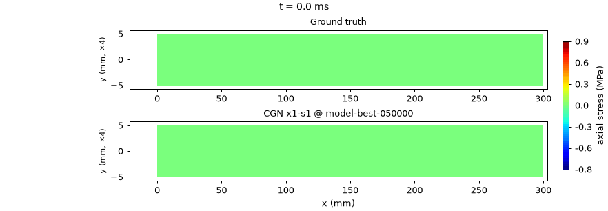
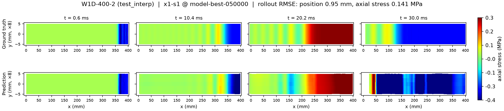
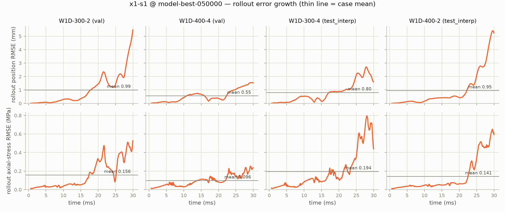

<!-- generated by tools/gen_benchmark_docs.py; do not edit by hand -->

# Wave1D-Propagation — StructBench benchmark

## Figures



*Ground truth (top) vs CGN prediction (bottom) on held-out W1D-300-4 (test_interp): a 300 mm bar at 4 mm/ms initial velocity, coloured by axial stress, y-axis exaggerated x8. The surrogate tracks the compression front, the free-end reflections, and the cycle timing over the 30 ms rollout; degradation concentrates in the final ~5 ms.*



*In-distribution (test_interp, 400 mm bar at 2 mm/ms): ground truth (top) vs CGN prediction (bottom), axial stress at t = 0.6 / 10.4 / 20.2 / 30.0 ms (y x8). The prediction reproduces the wavefront position and reflection cycles; late-horizon fields roughen and overshoot near the impact end (rollout position RMSE 0.95 mm).*



*Rollout error vs time for the CGN baseline (fleet run x1-s1): position RMSE (top) and axial-stress RMSE (bottom) for each eval case. Error is concentrated in the final ~5 ms of the 30 ms horizon; the held-out test_interp cases match the val cases (no interpolation cliff).*

## Data at a glance

- Solver: LS-DYNA (SPH; erosion: no)
- Loading: initial velocity 1-8 mm/ms; elastic wave propagation; wave speed ~70.7 mm/ms (~10 traversals per trajectory)
- Geometry: 2D strip, 5 particle rows, {200, 300, 400, 500} mm x 8 mm
- Source units: kg-mm-ms (canonical storage is strict SI, ADR-0012)
- Cases: 16 (train 12, val 2, test_interp 2)
- Particles per case: 500-1250; 302 frames at 0.1 ms; 0.23 GB on disk
- Fields: node/displacement, node/velocity, node/acceleration, sph/stress, sph/strain, sph/strain_rate, sph/effective_plastic_strain, sph/pressure, sph/density, sph/internal_energy, sph/mass, sph/radius, sph/n_neighbors, sph/deletion, global/kinetic_energy, global/internal_energy, global/total_energy
- Provenance: LS-DYNA parametric sweep (4 bar lengths x 4 initial velocities) produced by Curtin collaborators; benchmark protocol per ADR-0025.
- License: CC BY 4.0

## Task

autoregressive transition (ADR-0025). Auxiliary target: `axial_stress` (MPa). Models advance the particle state autoregressively from a short ground-truth prefix and are scored on the full predicted rollout.

## Evaluation criteria

- Protocol (benchmark-owned, ADR-0032, ADR-0035): 6 input frames, horizon full, scored at native output times.
- Metrics: one-step and full-rollout position RMSE (mm); axial_stress RMSE (MPa).
- Quantities of interest: arrival_time_25, arrival_time_50, arrival_time_75, peak_stress.

<details>
<summary>Protocol rationale — the ground-truth timeline analysis behind these values (ADR-0032 §5)</summary>

input_frames = 6 (ADR-0035): C = 5 input velocities (input_frames - 1), the GNS reference history length; the model observes exactly these 6 ground-truth frames (indices 0-5) to seed the rollout, with no constant-velocity backfill. GT timeline analysis run 2026-07-06 (docs/timelines/wave_propagation_1d.md): a 6-frame observed prefix takes in 14.8% of initial KE worst-case (3.7% at 3 frames), and at the measured front speed ~70.7 mm/ms the wave reaches the first (25%) gauge about 7 frames in -- after the observed prefix -- so the arrival_time QoI is predicted, not observed. 6 is near the ceiling for this benchmark: a larger input_frames would risk seeding past first arrival.

</details>

## Numbers to beat

**CGN baseline** (cgn, 2026-07-10, commit `48046ea`)

_Trajectory error (RMSE)_

| split | rollout_pos_rmse_mm | rollout_axial_rmse_mpa | one_step_pos_rmse_mm | one_step_axial_rmse_mpa |
|---|---|---|---|---|
| test_interp | 0.875 | 0.1676 | 0.004882 | 0.01547 |

_Quantities of interest (MAE)_

| split | qoi_arrival_time_25_mae_ms | qoi_arrival_time_50_mae_ms | qoi_arrival_time_75_mae_ms | qoi_peak_stress_mae_mpa |
|---|---|---|---|---|
| test_interp | 0.1007 | 0.05045 | 0.1006 | 0.9665 |

*Single-scale CGN (ADR-0034) on the round-2 capacity recipe (hidden 128 / 10 MP steps / 2-layer node MLP, noise_std 0.06) at 50k steps, batch 32; seed 1 of the X1 arm (seeds 1-2) of the 2026-07-10 17-run recipe fleet, val-selected checkpoint model-best-050000.pt (50k), one A100-80GB, ~3.9 h. The winning arm beats the shipped-config control (64/5/1, noise 0.02) by ~2-3x on both rollout channels at half the step budget; blessed from the round-2 winner on maintainer instruction without the pre-declared 4-seed confirmation fleet. Caveats: test_interp is a 2-case split; rollout RMSE is dominated by the final ~5 ms of the 30 ms horizon; the pointwise-max peak_stress QoI overshoots in both held-out cases (pred 1.738/1.481 MPa vs true 0.860/0.426 MPa) - arrival-time QoIs are the trustworthy wave quantities (all within ~1 output frame).*

## Quickstart

```bash
pip install structbench  # or: pip install -e . from the repo
structbench-train --mode train --config configs/wave_propagation_1d/cgn.toml \
    --data-root /path/to/wave_propagation_1d --out runs/wave_propagation_1d-cgn
```

Dataset download and hosting: see the repository README. The cross-benchmark index is [docs/benchmarks.md](../benchmarks.md); machine-readable card metadata ships as `card.json` with the data archive.
