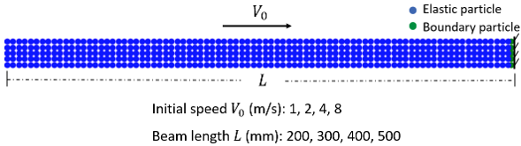
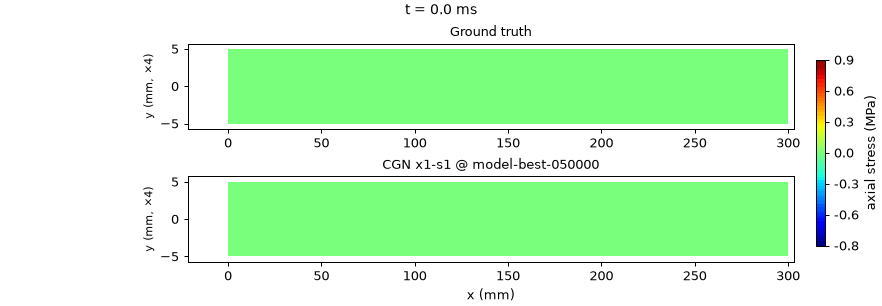
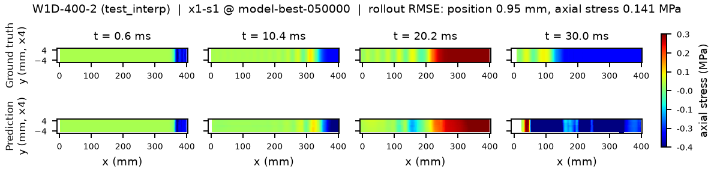

<!-- generated by tools/gen_benchmark_docs.py; do not edit by hand -->

# Wave1D-Propagation — StructBench benchmark

## The problem

Set a slender elastic bar moving along its axis and stop it dead at one end:
a compression front leaps from the impact end, sweeps back along the bar at
the material wave speed, reflects off the free end, and keeps traversing —
the textbook one-dimensional stress-wave problem. The particles barely move;
the travelling stress wave *is* the physics. That leaves a learned surrogate
nothing to hide behind: it must carry a sharp front through hundreds of
autoregressive steps and keep the wave speed, the reflection timing, and the
stress amplitude honest over 4–11 bar traversals, depending on length.

StructBench ships the 2D SPH version: an LS-DYNA `*MAT_ELASTIC` strip
(scaled toy constants) five particle rows deep, 8 mm wide and 200 / 300 /
400 / 500 mm long, arrested from an initial axial velocity of 1–8 m/s
(wave speed ~70.7 m/s). The task is an **autoregressive next-step
surrogate** — from a short ground-truth prefix the model advances the
particle state one output step at a time over the 30 ms record, predicting
position and the per-particle axial stress. Axial stress is the headline
target and position the sanity check — the reverse of Taylor 2D's emphasis.



*Problem setup: an elastic bar strip (length L = 200–500 mm) moving axially
at 1–8 m/s is arrested dead at one end.*

## The entry tier

This is the platform's entry benchmark — 16 linear-elastic cases, 0.23 GB —
sized for onboarding, the docs tutorial, and CI-scale runs rather than for
separating strong methods. The split is an interior holdout on the 4-length
× 4-velocity grid, interpolation only: every length and every velocity
appears in training, `val` (300 mm at 2, 400 mm at 4 m/s) only picks each
run's checkpoint, and `test_interp` (300 mm at 4, 400 mm at 2 m/s) is
scored. Everything is reported in physical units — axial-stress RMSE in MPa,
position RMSE in mm — and the quantities of interest read the wave directly:
arrival time at the 25 / 50 / 75 % gauge stations and the peak stress. The
reference CGN baseline nails the arrival times and overshoots the peak.
Despite its entry-tier size, the benchmark separates prediction schemes
sharply (2026-08-28 multi-method fleet): the time-conditioned operators
(Transolver, GeoFLARE) beat CGN ~3x on the fields and ~10x on peak stress,
while every mesh-native autoregressive family (MGN, Transolver, GeoFLARE)
fails outright (relative L2 > 1) - the sustained 30 ms reverberation
recirculates rollout errors instead of letting them decay, and only CGN's
relative-displacement particle-graph formulation survives it. The
autoregressive rows are kept as deliberate negative results; the numbers
are below.

## Figures



*Ground truth (top) vs CGN prediction (bottom) on held-out W1D-300-4 (test_interp): a 300 mm bar at 4 m/s initial velocity, coloured by axial stress, y-axis exaggerated x4. The surrogate tracks the compression front, the free-end reflections, and the cycle timing over the 30 ms rollout; degradation concentrates in the final ~5 ms.*



*In-distribution (test_interp, 400 mm bar at 2 m/s): ground truth (top) vs CGN prediction (bottom), axial stress at t = 0.6 / 10.4 / 20.2 / 30.0 ms (y x4). The prediction reproduces the wavefront position and reflection cycles; late-horizon fields roughen and overshoot near the impact end (rollout position RMSE 0.95 mm).*

## Data at a glance

- Solver: LS-DYNA (SPH; erosion: no)
- Loading: initial velocity 1-8 m/s; elastic wave propagation; wave speed ~70.7 m/s (4-11 traversals per trajectory, by bar length)
- Geometry: 2D strip, 5 particle rows, {200, 300, 400, 500} mm x 8 mm
- Source units: kg-mm-ms (canonical storage is strict SI, ADR-0012)
- Cases: 16 (train 12, val 2, test_interp 2)
- Particles per case: 500-1250; 302 frames at 0.1 ms; 0.23 GB on disk
- Fields: node/displacement, node/velocity, node/acceleration, sph/stress, sph/strain, sph/strain_rate, sph/effective_plastic_strain, sph/pressure, sph/density, sph/internal_energy, sph/mass, sph/radius, sph/n_neighbors, sph/deletion, global/kinetic_energy, global/internal_energy, global/total_energy
- Provenance: LS-DYNA parametric sweep (4 bar lengths x 4 initial velocities) produced by Curtin collaborators; benchmark protocol per ADR-0025.
- License: CC BY 4.0
- Data: maintainer-held, shared on request (ADR-0040)

## Task

autoregressive transition (ADR-0025). Auxiliary target: `axial_stress` (MPa). Models advance the particle state autoregressively from a short ground-truth prefix and are scored on the full predicted rollout.

## Evaluation criteria

- Protocol (benchmark-owned, ADR-0032, ADR-0035): 6 input frames, horizon full, scored at native output times.
- Metrics: headline is the pooled space+time relative L2 (displacement + axial_stress); also reported are position/axial_stress RMSE (physical units) and one-step RMSE, plus the quantities of interest below.
- Quantities of interest: arrival_time_25, arrival_time_50, arrival_time_75, peak_stress.

<details>
<summary>Protocol rationale — the ground-truth timeline analysis behind these values (ADR-0032 §5)</summary>

input_frames = 6 (ADR-0035): C = 5 input velocities (input_frames - 1), the GNS reference history length; the model observes exactly these 6 ground-truth frames (indices 0-5) to seed the rollout, with no constant-velocity backfill. GT timeline analysis run 2026-07-06 (docs/timelines/wave_propagation_1d.md): a 6-frame observed prefix takes in 14.8% of initial KE worst-case (3.7% at 3 frames), and at the measured front speed ~70.7 m/s the wave reaches the first (25%) gauge about 7 frames in -- after the observed prefix -- so the arrival_time QoI is predicted, not observed. 6 is near the ceiling for this benchmark: a larger input_frames would risk seeding past first arrival.

</details>

## Leaderboard

The headline metric is the pooled space+time relative L2 (↓ lower is better); the Scheme column is the prediction scheme. RMSE and quantities of interest are shown for the in-distribution `test_interp` split.

_Headline — pooled relative L2 (↓ better)_

| Method | Scheme | interp·disp | interp·aux |
|---|---|---|---|
| CGN | autoregressive | 0.35070 | 0.90250 |
| MGN | autoregressive | 1.56600 | 2.07900 |
| Transolver | autoregressive | 1.26100 | 1.01300 |
| Transolver | time-conditioned | 0.11330 | 0.21200 |
| GeoFLARE | autoregressive | 1.07100 | 0.97980 |
| GeoFLARE | time-conditioned | 0.13200 | 0.34750 |

_Trajectory error — RMSE_

| Method | Scheme | interp·pos (mm) | interp·axial (MPa) |
|---|---|---|---|
| CGN | autoregressive | 0.87500 | 0.16760 |
| MGN | autoregressive | 5.36300 | 0.55610 |
| Transolver | autoregressive | 4.18000 | 0.28190 |
| Transolver | time-conditioned | 0.39900 | 0.06464 |
| GeoFLARE | autoregressive | 3.79800 | 0.27810 |
| GeoFLARE | time-conditioned | 0.50070 | 0.09531 |

_Quantities of interest (MAE)_

| Method | Scheme | interp·arrival_time_25 (ms) | interp·arrival_time_50 (ms) | interp·arrival_time_75 (ms) | interp·peak_stress (MPa) |
|---|---|---|---|---|---|
| CGN | autoregressive | 0.10070 | 0.05045 | 0.10060 | 0.96650 |
| MGN | autoregressive | 1.20000 | 0.70550 | 0.25180 | 0.99740 |
| Transolver | autoregressive | 0.40350 | 1.25100 | 1.35100 | 0.52250 |
| Transolver | time-conditioned | 0.15120 | 0.09060 | 0.10060 | 0.09222 |
| GeoFLARE | autoregressive | 1.19900 | 0.73490 | 0.15100 | 0.60250 |
| GeoFLARE | time-conditioned | 0.25190 | 0.10050 | 0.35250 | 0.13200 |

## Baseline details

**CGN** (cgn, 2026-07-10, commit `48046ea`, checkpoint: `models/wave_propagation_1d/cgn-48046ea/model-best-050000.pt` — private archive; publication parked)

*Single-scale CGN (ADR-0034) on the round-2 capacity recipe (hidden 128 / 10 MP steps / 2-layer node MLP, noise_std 0.06) at 50k steps, batch 32; seed 1 of the X1 arm (seeds 1-2) of the 2026-07-10 17-run recipe fleet, val-selected checkpoint model-best-050000.pt (50k), one A100-80GB, ~3.9 h. The winning arm beats the shipped-config control (64/5/1, noise 0.02) by ~2-3x on both rollout channels at half the step budget; blessed from the round-2 winner on maintainer instruction without the pre-declared 4-seed confirmation fleet. Caveats: test_interp is a 2-case split; rollout RMSE is dominated by the final ~5 ms of the 30 ms horizon; the pointwise-max peak_stress QoI overshoots in both held-out cases (pred 1.738/1.481 MPa vs true 0.860/0.426 MPa) - arrival-time QoIs are the trustworthy wave quantities (all within ~1 output frame). Relative L2 (rollout_rel_l2_disp/aux) is the pooled space+time headline (ADR-0055), added 2026-08-16 from a re-eval on this checkpoint; RMSE reproduced to <1%, so the blessed RMSE/QoI values are unchanged. Standing after the 2026-08-28 multi-method fleet: the ONLY autoregressive family that is stable on wave (every mesh-native AR arm lands at relative L2 > 1) - the relative-displacement particle-graph formulation survives the sustained oscillation that breaks the mesh-native adaptations - though both time-conditioned operators beat it ~3x on the fields.*

**MGN** (mgn, 2026-08-28, commit `e6482f2`)

*Native MeshGraphNets, DELIBERATE NEGATIVE ROW (see module header): FAILS on wave - displacement relative L2 1.566 (> 1, worse than predicting zero), stress 2.079. Not a recipe gap: the arm carries the full ADR-0049 repair (velocity history 5, working-frame noise 0.06 = the blessed wave CGN value, stretch gate off, world-edge radius below the lattice spacing so world edges act only as a contact detector), one-step is healthy (0.0139 mm) and train loss converges, but the val rollout oscillated 5-80 mm all training long - rollout instability under the 30 ms sustained reverberation, the regime the decaying impact transients (taylor/notch) never enter. Run wave-mgn-s1, 50k steps, val-selected model-best-038000.pt, single seed. PROVISIONAL (ADR-0044/0046). Pooled relative L2 headline (ADR-0055).*

**Transolver** (transolver, 2026-08-28, commit `e6482f2`)

*Native autoregressive Transolver, DELIBERATE NEGATIVE ROW (see module header): FAILS on wave - displacement relative L2 1.261 (> 1), stress 1.013 - reproducing the 2026-08-21 diverged control (1.26/1.01) whose artifacts were lost with the EMI26 worktree. The failure is INTRINSIC, not a noise-transfer artifact: the low-noise sibling arm wave-transolver-ar-n02-s1 (noise 0.02, the taylor-validated transolver-AR value, vs this arm's 0.06 CGN transfer) fails identically (1.395, best checkpoint already at step 2k). One-step is healthy (0.0133 mm); the same repaired recipe (ADR-0049 velocity history + noise) is registered and functional on taylor (0.0213) and notch (0.0641) - wave's sustained oscillation is the one regime where errors recirculate instead of decaying. Run wave-transolver-ar-s1, 50k steps, val-selected model-best-030000.pt, single seed. PROVISIONAL (ADR-0044/0046). Pooled relative L2 headline (ADR-0055).*

**Transolver** (transolver, 2026-08-28, commit `e6482f2`)

*Native time-conditioned Transolver (ADR-0054): history-free, each frame predicted independently from the rest lattice + normalized query time + initial-velocity scalar (ADR-0051 B), no rollout accumulation, so one-step is N/A. The STRONGEST wave baseline: beats the blessed CGN ~3.1x on displacement relative L2 (0.113 vs 0.351), ~4.3x on the stress field (0.212 vs 0.903) and ~10x on the peak-stress QoI (0.092 vs 0.966 MPa - the QoI the CGN blessing flags as its overshoot); arrival times sit at the 0.05 ms frame-tick floor for both (2-3 ticks vs CGN's 1-2). Because it never rolls out, it survives the oscillatory regime that fails every mesh-native autoregressive family (see module header). Re-establishes with registry-grade artifacts the 2026-08-21 EMI26 result whose runs were lost (F-006). Seed 1 of the s1-s2 pair, val-selected (val relative L2 0.0973 vs seed 2's 0.1238; seed 2 test displacement 0.1342), run wave-transolver-timecond-s1, 50k steps, model-best-042000.pt, ~25 min A100. PROVISIONAL (ADR-0044/0046): not validated against a published wave-Transolver number; 2-case test split (benchmark caveat). Pooled relative L2 headline (ADR-0055).*

**GeoFLARE** (geoflare, 2026-08-28, commit `e6482f2`)

*Native autoregressive GeoFLARE, DELIBERATE NEGATIVE ROW (see module header): FAILS on wave - displacement relative L2 1.071 (> 1), the third mesh-native autoregressive family to fail on this benchmark (least badly of the three). One-step is healthy (0.0185 mm); the rollout is unstable under the 30 ms sustained reverberation. Same repaired recipe as the taylor GeoFLARE arm (ADR-0049 velocity history 5 + the blessed wave CGN noise 0.06). Run wave-geoflare-ar-s1, 50k steps, val-selected model-best-032000.pt, single seed. PROVISIONAL (ADR-0045/0046). Pooled relative L2 headline (ADR-0055).*

**GeoFLARE** (geoflare, 2026-08-28, commit `e6482f2`)

*Native GeoFLARE under the time-conditioned scheme (ADR-0054): history-free independent-time-query with the initial-velocity scalar (ADR-0051 B), no rollout, so one-step is N/A. Confirms the scheme effect on a second operator family: beats the blessed CGN ~2.7x on displacement relative L2 (0.132 vs 0.351), ~2.6x on the stress field and ~7x on peak stress (0.132 vs 0.966 MPa), while its autoregressive sibling above fails outright - on wave the scheme, not the architecture, is what separates success from failure. Behind the time-conditioned Transolver on every metric, as on notch and DeformingPlate. Seed 2 of the s1-s2 pair, val-selected (val relative L2 0.1290 vs seed 1's 0.1448; seed 1 test displacement 0.1512), run wave-geoflare-timecond-s2, 50k steps, model-best-048000.pt, ~36 min A100. PROVISIONAL (ADR-0045/0046): 2-case test split (benchmark caveat). Pooled relative L2 headline (ADR-0055).*

## Quickstart

```bash
pip install structbench  # or: pip install -e . from the repo
structbench-train --mode train --config configs/wave_propagation_1d/cgn.toml \
    --data-root /path/to/wave_propagation_1d --out runs/wave_propagation_1d-cgn
```

This config is the blessed baseline recipe verbatim, seed included — after training, `structbench-train --mode valid` and `--mode rollout` against the run directory regenerate the `metrics-<split>.json` files behind the numbers above (expect statistically similar rather than bit-identical numbers under GPU nondeterminism; the registry's checkpoint pointer and SHA-256 identify the exact blessed artifact).

Dataset access: the canonical archive is maintainer-held on institutional storage and shared on request (ADR-0040) — contact the maintainer, or ingest your own LS-DYNA output via the adapter; see the repository README. The cross-benchmark index is [docs/benchmarks.md](../benchmarks.md); machine-readable card metadata ships as `card.json` with the data archive.

## References

- **CGN** — Li, Q., Wang, Z., Li, L., Hao, H., Chen, W., & Shao, Y. (2023). Machine learning prediction of structural dynamic responses using graph neural networks. *Computers & Structures*, 289, 107188. https://doi.org/10.1016/j.compstruc.2023.107188
- **MGN** — Pfaff, T., Fortunato, M., Sanchez-Gonzalez, A., & Battaglia, P. W. (2021). Learning Mesh-Based Simulation with Graph Networks. *ICLR*. https://arxiv.org/abs/2010.03409
- **Transolver** — Wu, H., Luo, H., Wang, H., Wang, J., & Long, M. (2024). Transolver: A Fast Transformer Solver for PDEs on General Geometries. *ICML*. https://arxiv.org/abs/2402.02366
- **GeoFLARE** — Adams, R., et al. (NVIDIA). GeoTransolver. arXiv:2512.20399; with Puri, R., et al. FLARE: Fast Low-rank Attention Routing Engine. arXiv:2508.12594. GeoFLARE is GeoTransolver with the FLARE attention backend (attention_type GALE_FA; ADR-0045).
